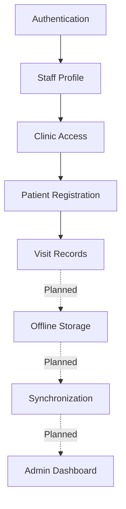
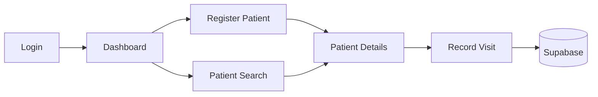

# HealthStats — Features

HealthStats is an offline-first healthcare record and disaster-response platform designed for rural clinics in Bangladesh.

---

## Feature Status Legend

| Status | Meaning |
|---|---|
| **Implemented** | Currently working in the application |
| **In Progress** | Partially implemented or UI built without backend wiring |
| **Planned** | Defined in the project plan but not implemented |
| **Optional** | Nice-to-have feature |
| **Not Started** | Identified but development has not begun |

---

## Feature Overview

| Feature | Category | Status | Priority |
|---|---|---|---|
| Authentication | Security | Implemented | Critical |
| Role-Based Access | Security | Implemented | Critical |
| Patient Registration | Patient Records | Implemented | Critical |
| Patient Search | Patient Records | Implemented | High |
| Visit Records & Forms | Patient Records | Implemented | High |
| Offline Storage | Offline-First | Not Started | Critical |
| Automatic Sync | Offline-First | Not Started | Critical |
| OCR | Intelligence | Not Started | Optional |
| AI-Assisted Triage | Intelligence | Not Started | Optional |
| Admin Dashboard | Administration | In Progress | Medium |
| Emergency Mode | Disaster Response | In Progress | High |
| Outbreak Detection | Disaster Response | Planned | Medium |
| Bangla/English | Accessibility | Implemented | Critical |
| Dark Mode | UI/UX | Implemented | High |
| PWA | Platform | Not Started | High |

---

## 1. Product Vision

HealthStats is designed around:
1. **Offline-first healthcare records:** The app must never block the user waiting for a network request.
2. **Simple workflows for health workers:** Streamlined, large-tap-target interfaces.
3. **Secure role-based access:** Strict boundaries between clinics and administrative staff.
4. **Reliable synchronization:** Eventual consistency with a central database.
5. **Disaster-ready operations:** Specialized workflows for floods and cyclones.
6. **Bilingual accessibility:** Native Bangla support for rural contexts.
7. **Low-resource optimization:** Fast operation on older devices and low battery constraints (Dark mode).

---

## 2. Authentication & Access Control

### Login
- **Who can log in**: Pre-approved community health workers and clinic administrators.
- **Authentication Provider**: Supabase Auth (Email/Password).
- **Session Handling**: Managed globally via `AuthContext.tsx`. Unauthenticated users are redirected to `/login`.
- **Demo Mode**: For development and exhibition testing, entering `worker@clinic.org` with `password123` bypasses Supabase Auth and injects a mock session.

### Role-Based Access
- **Worker**: Authorized to log visits and register patients only for their assigned clinic.
- **Admin**: Authorized to view aggregated analytics across all clinics.

### Clinic-Level Access
Users are mapped to physical clinics via the `staff` table (`clinic_id`). The application strictly relies on this injected ID for mutations (like patient registration) rather than trusting user-provided inputs.

### Row Level Security (RLS)
The intended production security architecture uses Supabase RLS to protect all tables (`clinics`, `staff`, `patients`, `visits`, `sync_log`) and Security Definer functions to enforce that workers only interact with their own clinic's data. 
*(Note: In the current MVP development state, RLS is intentionally disabled in `initial_schema.sql` to facilitate rapid prototyping. Therefore, RLS does not currently protect the deployed MVP).*

---

## 3. Patient Record Management

### Patient Registration
- **Status**: Implemented
- **Workflow**: 
  - Validates inputs (Full Name, Age, Sex, Village, Emergency Contact).
  - Automatically injects the authenticated worker's `clinic_id`.
  - Submits directly to the Supabase `patients` table.
  - Success behavior: Displays a confirmation screen and routes the user to the newly created Patient Detail view.

### Patient List & Search
- **Status**: Implemented
- **Features**: Interface successfully lists patients mapped to the user's clinic and allows search by name/ID/village. Dynamic urgency and recency filtering is fully wired to Supabase.

### Patient Details & History
- **Status**: Implemented
- **Features**: `PatientDetailPage` loads the selected patient (name, age, sex, village, registration date, clinic) and all of their visits from Supabase. Tabs show Vitals History (per-visit readings from the `vitals` JSONB, with trend sparklines once 2+ readings exist), Visit History (clinician, symptom category, symptoms, diagnosis, urgency, sync status) and Diagnoses. Reachable from the Patients list (click a name), after registration, or after saving a visit. Fields with no schema backing (allergies, blood type, medications, emergency contact) are no longer shown.

---

## 4. Visit & Health Records

### Vitals & Clinical Forms
- **Status**: Implemented
- **Workflow** (`VitalsPage`, "Record Visit"):
  - Select a patient from the worker's clinic (searchable list), or arrive pre-selected via "New Visit" on a patient record.
  - Enter vitals (BP, temperature, pulse, weight, SpO₂, respiratory rate, MUAC) — only entered values are stored in the `vitals` JSONB.
  - Chief complaint (required, free text) and optional symptom chips → `symptoms`.
  - Symptom Category dropdown (`diarrhea/gastrointestinal`, `fever`, `respiratory`, `skin/rash`, `other`) → `symptom_category`, kept separate from the free-text symptoms for outbreak monitoring.
  - Diagnosis / assessment → `diagnosis`; Urgency Score 1–5 → `urgency_score` (the on-device AI Urgency Check pre-fills a suggestion; the worker can override).
  - Saves directly to `visits` with `patient_id`, `staff_id` (from the authenticated staff profile) and `synced_at`. Shows a success screen linking to the patient record.
- **Limitations**: Online only (no offline queue yet). English-only strings, consistent with the rest of the clinical forms. Visits cannot be edited after saving.

---

## 5. Offline-First Capability

*This is the core architectural pillar of HealthStats, currently pending implementation.*

### Online Mode
When internet is available, data mutations will bypass the local queue and save directly to Supabase.

### Offline Mode
When the network drops, mutations will be gracefully intercepted without blocking the user.

### Local Storage
Planned to utilize browser-based storage (IndexedDB via Dexie.js) to store pending records locally on the device.

### Sync Queue & Status
Records created offline will sit in a local queue. The application will monitor `navigator.onLine` and display sync badges in the navigation sidebar (e.g., "14 records queued").

### Conflict Resolution
Conflict resolution logic (handling edits to the same record by two offline devices) is planned and is not currently implemented.

---

## 6. Data Synchronization

- **When it occurs**: Automatically when connectivity returns, managed by a Service Worker or background queue loop.
- **What gets synced**: Queued patient registrations and clinical visits.
- **Audit Logging**: Synchronizations will be securely logged in the `sync_log` table to monitor sync health and device IDs.

---

## 7. OCR / Paper Record Digitization

- **Status**: Planned (UI static shell exists: `DigitizePage.tsx`)
- **Purpose**: To quickly digitize legacy paper-based healthcare records using optical character recognition (OCR), easing the transition to the EHR system.

---

## 8. AI-Assisted Triage

- **Status**: Optional / Future
- **Purpose**: An algorithm (rule-based or lightweight ML) to automatically calculate an `urgency_score` based on entered vitals and symptoms, flagging patients who require immediate attention.
*(Note: This feature is currently deferred as an optional future enhancement. The project's primary intelligence path focuses on OCR digitization.)*

---

## 9. Administration & Dashboard

### Admin Dashboard
- **Status**: In Progress (Static UI exists: `AdminDashboardPage.tsx`)
- **Capabilities**: Displays high-level clinic statistics, patient counts, and flagged high-risk visits. Real-time metric fetching is not yet connected to Supabase.

---

## 10. Staff Management

- **Status**: Manual Setup
- **Capabilities**: Currently, staff accounts and clinic assignments must be managed manually via the Supabase Dashboard / SQL Editor. An in-app UI for Admin staff management is planned but not implemented.

---

## 11. Emergency Mode

### Disaster Response Interface
- **Status**: In Progress (Static UI exists: `EmergencyDashboard.tsx`)
- **Purpose**: During floods or cyclones, health workers need rapid access to SOS protocols and priority patient lists without navigating complex menus.
- **Capabilities**: The UI provides specialized alerts and simplified workflows. Live external alert feeds (e.g., flood warnings) are planned but not connected.

---

## 12. Outbreak Detection

- **Status**: Planned
- **Purpose**: A symptom-cluster detection proof-of-concept. It will query visits from the last 48 hours to flag zones where a critical mass of similar symptoms (e.g., waterborne diseases) appear, alerting coordinators.

---

## 13. Language Support

- **Status**: Implemented
- **Supported**: Bangla and English
- **Mechanism**: A global `LanguageContext` allows instant UI translation. Core navigation and clinical forms are actively translated.

---

## 14. UI / UX

- **Status**: Implemented
- **Features**: Desktop-first responsive layout, accessible typography, loading skeleton states, and explicit empty states.
- **Dark Mode**: Fully integrated via `ThemeContext` for low-light environments and battery saving.
*(UI components strictly adhere to `docs/frontend-uiux.md`).*

---

## 15. Progressive Web App (PWA)

- **Status**: Planned
- **Capabilities**: Missing `manifest.json` and service worker caching required for true PWA installation and offline asset serving.

---

## 16. Security & Privacy

- **Supabase Authentication**: Protects all routes from unauthorized access.
- **Row Level Security**: Database-level enforcements to prevent cross-clinic data leakage.
- **Development Best Practices**: Developers are explicitly instructed to use fictional patient data only and to never commit `.env` secrets.

---

## 17. Feature Dependencies

---

## 18. Core User Flows

### Health Worker Flow

---

## 19. Development Roadmap

### Phase 0 — Foundation (Completed)
- React, Vite, Tailwind setup
- Supabase schema & authentication scaffolding

### Phase 1 — Patient & Visit Records (In Progress)
- Patient registration (Completed)
- Patient lists and retrieval
- Visit forms

### Phase 2 — Offline Engine (Pending)
- IndexedDB storage integration
- Background sync queue

### Phase 3 — Intelligence (Pending)
- OCR for digitizing paper healthcare records (Proof of Concept)

### Phase 4 — Emergency & Admin (Pending)
- Admin dashboards connected to live data
- Emergency mode alert feeds
- Symptom clustering (Outbreak Detection)

### Phase 5 — Testing & Demo (Pending)
- PWA manifests
- Exhibition preparations

---

## 20. Current Implementation Status

| Area | Current Status | Notes |
|---|---|---|
| Database Schema | Implemented | `clinics`, `staff`, `patients`, `visits`, `sync_log` created |
| RLS | Planned / Production Required | RLS is the intended production security architecture but is disabled in the current MVP development schema |
| Authentication | Implemented | UI + Context + Demo Bypass |
| Patient Registration | Implemented | Task 4 completed; successfully saves to Supabase |
| Patient Details/List | Implemented | Tasks 5/6; list and detail read from Supabase |
| Vitals/Visits | Implemented | Task 6; `VitalsPage` inserts into `visits` |
| Admin Dashboard | In Progress | UI MVP completed; pending real data |
| Emergency Mode | In Progress | UI MVP completed; pending real data |
| Offline Storage | Not Started | Dexie.js integration pending |
| Background Sync | Not Started | Queue/Service Worker pending |
| PWA | Not Started | Manifest pending |
| OCR | Not Started | Proof of concept pending |

---

## 21. Exhibition Demo Priorities

For exhibition purposes, the core story is: **"Healthcare records remain useful even when the internet does not."**

Currently, the strongest demoable features are:
1. The **Patient Registration → Record Visit → Patient Record** flow (live database mutations and reads).
2. The **Bilingual & Dark Mode UI** (accessibility).
3. The **Emergency Dashboard Shell** (UI concepts).

*Note: True offline capability is not yet complete and cannot be demonstrated reliably until Phase 2 is finished. Do not fake offline functionality for the demo.*

---

## 22. Known Limitations

- **Offline Engine:** Not currently functional. Network drops will cause mutations to fail.
- **Data Fetching:** Admin, Emergency, Sync and Triage views still rely on hardcoded dummy data arrays. The worker dashboard home (recent patients, stats) is also static.
- **Admin Configuration:** Creating clinics and staff accounts must be done manually via SQL.
- **Translation:** Some deep UI elements lack complete Bangla translation strings.

---

## 23. Future Enhancements

- Robust sync conflict resolution.
- Native mobile app wrapping (Capacitor/React Native).
- Production-grade CI/CD and automated testing.
- SMS-based alerts for critical patients.
