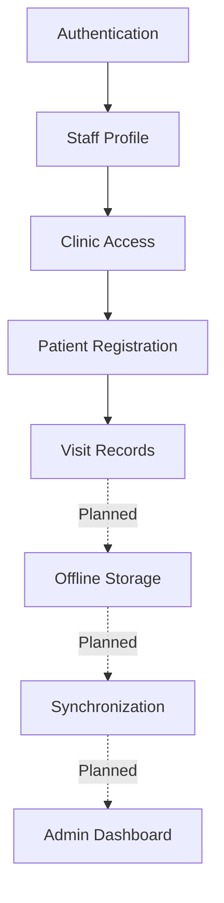
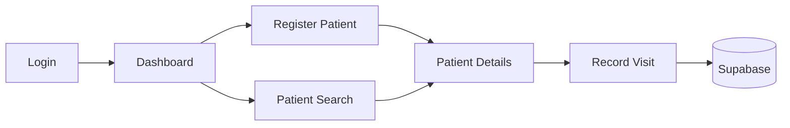

# HealStats — Features

HealStats is an offline-first healthcare record and disaster-response platform designed for rural clinics in Bangladesh.

---

## Feature Status Legend

| Status | Meaning |
|---|---|
| **Implemented** | Currently working in the application |
| **In Progress** | Partially implemented or UI built without backend wiring |
| **Planned** | Defined in the project plan but not implemented |
| **Optional** | Nice-to-have feature |
| **Not Started** | Identified but development has not begun |

---

## Feature Overview

| Feature | Category | Status | Priority |
|---|---|---|---|
| Authentication | Security | Implemented | Critical |
| Role-Based Access | Security | Implemented | Critical |
| Nurse Station & Vitals | Clinical Operations | Implemented | Critical |
| Clinical Officer Station | Clinical Operations | Implemented | Critical |
| Patient Registration | Patient Records | Implemented | Critical |
| Patient Search | Patient Records | Implemented | High |
| Visit Records & Forms | Patient Records | Implemented | High |
| Offline Storage | Offline-First | Implemented | Critical |
| Automatic Sync | Offline-First | Implemented | Critical |
| OCR | Intelligence | Implemented | Optional |
| AI-Assisted Triage | Intelligence | Deferred (Optional) | Optional |
| AI Assistant (Chatbot) | Intelligence | Implemented | Medium |
| Admin Dashboard | Administration | Implemented | Medium |
| Staff Management | Administration | Implemented | Medium |
| Emergency Mode | Disaster Response | Implemented | High |
| Outbreak Detection | Disaster Response | Implemented | Medium |
| Emergency Triage Queue | Disaster Response | Implemented | High |
| Clinic Operations Map | Administration | In Progress (Leaflet verified with mocks; database activation pending) | Medium |
| Bangla/English | Accessibility | Implemented (full page coverage) | Critical |
| Dark Mode | UI/UX | Implemented | High |
| Motion & Animation | UI/UX | Implemented | Medium |
| Error/Empty/Loading States | UI/UX | Implemented | High |
| End-to-End Testing | Quality | Implemented (safe flows) | Medium |
| PWA | Platform | Implemented | High |

---

## 1. Product Vision

HealStats is designed around:
1. **Offline-first healthcare records:** The app must never block the user waiting for a network request.
2. **Simple workflows for health workers:** Streamlined, large-tap-target interfaces.
3. **Secure role-based access:** Strict boundaries between clinics and administrative staff.
4. **Reliable synchronization:** Eventual consistency with a central database.
5. **Disaster-ready operations:** Specialized workflows for floods and cyclones.
6. **Bilingual accessibility:** Native Bangla support for rural contexts.
7. **Low-resource optimization:** Fast operation on older devices and low battery constraints (Dark mode).

---

## 2. Authentication & Access Control

### Login
- **Who can log in**: Pre-approved community health workers and clinic administrators.
- **Authentication Provider**: Supabase Auth (Email/Password).
- **Session Handling**: Managed globally via `AuthContext.tsx`. On load the session is
  restored from Supabase and the staff profile (role + `clinic_id`) is resolved before
  any protected view renders (a loading spinner is shown meanwhile). Unauthenticated
  users on a protected page are redirected to the appropriate login screen. On sign-out
  the session is cleared and protected content becomes inaccessible.
- **Edge cases handled (Task 25)**: session restored across browser refresh; expired/
  invalid sessions fall back to login; a valid session with **no linked `staff` profile**
  shows an explicit "Account not linked" screen with a Sign out action (instead of a
  dead-end); no flash of protected/admin content before authorization resolves; sign-in
  network/unexpected failures surface a plain-language error.
- **Demo Bypass Removal (Task 25.1)**: All hardcoded demo credentials, synthetic sessions, and application-level auth bypasses have been completely removed. Both worker (`LoginPage.tsx`) and admin (`AdminLoginPage.tsx`) authenticate against Supabase Auth (`signInWithPassword`) and resolve real staff profiles. For deterministic testing, mock responses are strictly isolated to Playwright network route interception (`tests/e2e/helpers.ts`) and never present in production application code.
- **QA regression fixes (2026-09-08)**: Login no longer creates missing staff rows or fabricates a profile from user metadata. If staff lookup (including the existing email fallback) cannot find a record, protected content remains inaccessible and Account not linked is shown. Routing waits for profile resolution and admin-login authorization before navigating; rejected admin sign-ins stay on the login screen with an error. Signup provisioning is unchanged and must successfully create a real staff record.
- **Public entry points**: Log In opens authentication; Sign Up and the hero Get Started button open registration. Logout returns to the public landing page. Guest navbar auth actions live in the drawer below 1280px to prevent overlap with language, theme, and menu controls.

### Self-Registration (Sign Up)
- **Status**: Implemented (`SignUpPage.tsx`).
- **Flow**: Creates a Supabase Auth user (`supabase.auth.signUp`) and a linked `staff` row (name, email, `auth_user_id`, optional `clinic_id` chosen from the live clinics list). Handles email-confirmation vs. immediate-session cases and reports duplicate-email/validation errors inline.
- **Security**: Hardened in Task 25.1 — public signup is strictly limited to clinical worker designations (`community_health_worker`, `nurse`, `clinical_officer`). The resulting database payload enforces `role: "worker"`. District administrator and patient signup options have been eliminated.
- **Limitation**: Because MVP RLS is disabled, the client currently inserts the `staff` row directly. Under production RLS, this will be handled via the prepared `staff_self_insert` policy or a DB trigger. See `LIMITATIONS.md`.

### Role-Based Access & Strict Role Boundaries
- **Admin**: Authorized solely for administrative oversight (Clinic ops, Staff management, Patient directory overview, Analytics, Outbreak radar). Admins do not have access to Nurse Station or Clinical Officer Station clinical workflow pages.
- **Nurse**: Authorized for patient triage, vitals recording (BP, pulse, temp, SpO2, respiratory rate, BMI), visit notes, and urgency management (1–5 urgency scale). Nurses are strictly forbidden from the Admin panel and Clinical Officer Station.
- **Clinical Officer**: Authorized for patient diagnosis (primary/secondary), clinical findings evaluation, treatment planning, and multi-medication prescribing. Clinical Officers view nurse vitals in read-only mode and cannot modify nurse triage urgency. Clinical Officers are strictly forbidden from the Admin panel and Nurse Station.
- **Community Health Worker (CHW)**: Authorized for basic community patient registration, intake vitals, and offline field queueing. CHWs are forbidden from the Admin panel.
- **Enforcement**: Strict, multi-layered role gating:
  1. `App.tsx` redirects Nurses attempting to access `/admin` or `/clinical-officer` back to `/nurse`.
  2. `App.tsx` redirects Clinical Officers attempting to access `/admin` or `/nurse` back to `/clinical-officer`.
  3. `App.tsx` redirects Admins attempting to access `/nurse` or `/clinical-officer` back to `/admin`.
  4. Render-time guards prevent any flash of unauthorized screens before redirects resolve.
  5. `AdminLoginPage.tsx` actively inspects account designation and rejects any Nurse or Clinical Officer credentials with access denied.
  6. `AppNavbar.tsx` user menu dynamically renders ONLY the specific workstation relevant to the user's role.
  7. `LoginPage.tsx` includes an intuitive Workstation selector (Auto-detect, Nurse Station, Clinical Officer) and directly routes users upon authentication to their respective station without ever redirecting to the admin page.

### Clinic-Level Access
Users are mapped to physical clinics via the `staff` table (`clinic_id`). The application strictly relies on this injected ID for mutations (like patient registration) rather than trusting user-provided inputs.

### Profiles (Task 26)
- **Staff Profile** (`StaffProfilePage.tsx`): dual-mode profile supporting both self-inspection ("My Profile" accessible via the navbar user menu on both worker and admin dashboards) and administrator inspection of staff members directly from Staff Management (`StaffPage.tsx`). Sourced entirely from live Supabase data — full name, role badge (Healthcare Worker / District Administrator), assigned clinic with zone and address (resolved from Supabase; "All clinics" for district-level admins), short staff ID with copyable UUID, account email, account & security access permissions, and live central database activity metrics (total clinical visits recorded and last encounter timestamp). Back navigation (`onBack`) seamlessly returns to the dashboard or staff directory.
- **Patient Profile** (`PatientDetailPage.tsx`): structured healthcare profile layout with Patient Header (avatar initials, name, short ID + copyable UUID, clinic, 1–5 urgency scale badge with numerical score, level label, and icon), Patient Information card (age, sex, village, registration date, facility), Latest Health Overview card (date, latest vitals, diagnosis, symptoms, clinician), Vitals History tab with sparklines & detailed table, Visit History tab with chronological timeline & expandable encounters, Diagnoses tab, honest offline-first fallback checking Dexie `offlineDb.pendingRecords` with "Saved locally (Pending Sync)" badge, loading skeleton, error banner with retry, and back navigation (`onBack`). Reachable from Patient Records, Flagged Patients, Emergency Triage, Outbreak Radar, and recent patients.
- **Admin Staff Management Integration**: `StaffPage.tsx` exposes a "View Profile" action and clickable staff member rows (`onViewStaff`), routing directly to `StaffProfilePage` within `AdminDashboardPage.tsx`.

### Row Level Security (RLS)
The intended production security architecture uses Supabase RLS to protect all tables (`clinics`, `staff`, `patients`, `visits`, `sync_log`) and Security Definer functions to enforce that workers only interact with their own clinic's data. 
*(Note: In the current MVP development state, RLS is explicitly disabled in `initial_schema.sql` to facilitate rapid prototyping. Therefore, RLS does not currently protect the live database).*
A prepared migration `20260905000001_enable_rls.sql` defines the clinic-scoped policies and self-signup worker role constraints. RLS is **prepared but unapplied** — application code is now hardened to comply with it, and activation remains a database deployment step. See `LIMITATIONS.md`.

---

## 3. Patient Record Management

### Patient Registration
- **Status**: Implemented
- **Workflow**: 
  - Validates inputs (Full Name, Age, Sex, Village, Emergency Contact).
  - Automatically injects the authenticated worker's `clinic_id`.
  - Submits directly to the Supabase `patients` table.
  - Success behavior: Displays a confirmation screen and routes the user to the newly created Patient Detail view.

### Patient List & Search
- **Status**: Implemented
- **Features**: Interface successfully lists patients mapped to the user's clinic and allows search by name/ID/village. Dynamic urgency and recency filtering is fully wired to Supabase.

### Patient Details & History
- **Status**: Implemented
- **Features**: `PatientDetailPage` loads the selected patient (name, age, sex, village, registration date, clinic) and all of their visits from Supabase. Tabs show Vitals History (per-visit readings from the `vitals` JSONB, with trend sparklines once 2+ readings exist), Visit History (clinician, symptom category, symptoms, diagnosis, urgency, sync status) and Diagnoses. Reachable from the Patients list (click a name), after registration, or after saving a visit. Fields with no schema backing (allergies, blood type, medications, emergency contact) are no longer shown.

---

## 4. Visit & Health Records

### Vitals & Clinical Forms
- **Status**: Implemented
- **Workflow** (`VitalsPage`, "Record Visit"):
  - Select a patient from the worker's clinic (searchable list), or arrive pre-selected via "New Visit" on a patient record.
  - Enter vitals (BP, temperature, pulse, weight, SpO₂, respiratory rate, MUAC) — only entered values are stored in the `vitals` JSONB.
  - Chief complaint (required, free text) and optional symptom chips → `symptoms`.
  - Symptom Category dropdown (`diarrhea/gastrointestinal`, `fever`, `respiratory`, `skin/rash`, `other`) → `symptom_category`, kept separate from the free-text symptoms for outbreak monitoring.
  - Diagnosis / assessment → `diagnosis`; Urgency Score 1–5 → `urgency_score` (the on-device AI Urgency Check pre-fills a suggestion; the worker can override).
  - Saves directly to `visits` with `patient_id`, `staff_id` (from the authenticated staff profile) and `synced_at`. Shows a success screen linking to the patient record.
- **Limitations**: Online only (no offline queue yet). English-only strings, consistent with the rest of the clinical forms. Visits cannot be edited after saving.

### Nurse Station & Clinical Urgency Management (Task 27)
- **Status**: Implemented (`NurseDashboardPage.tsx`, `/nurse`)
- **Purpose**: Dedicated clinical station tailored for staff nurses and clinical officers to triage patients, document vitals, record timestamped clinical notes, and manage patient urgency levels with live synchronization to the central administration directory.
- **Features**:
  - **Clinical KPI Banner & Metrics**: Displays live counters for Total Patients in Care, Critical (Level 5) Cases with animated pulse indicators, High Urgency (Level 4) Cases, and Today's Encounters.
  - **Live Triage Queue**: Search across patient name, ID, village, and clinic; filter by 5 standard urgency levels (Critical, High, Moderate, Low, Stable); sort by Highest Urgency first, Recent Visit, or Name.
  - **Patient Clinical Drawer**:
    - **Urgency Assessment**: 5 urgency levels with clinical guidance. Updating urgency persists an assessment entry in `visits` via `updatePatientUrgency`, instantly reflecting in the Admin Patients directory.
    - **Record Vitals**: Validation for Blood Pressure (systolic/diastolic), Pulse/Heart Rate, Temperature (°C), Oxygen Saturation (SpO2 % with hypoxemia warnings below 92%), Respiratory Rate, Weight (kg), and Height (cm). Saves directly to database with offline fallback (`offlineDb.pendingRecords`).
    - **Visit Notes**: Add nursing observations and interventions with staff author attribution and chronological timeline.
    - **Chronological History**: Past vitals readings with abnormal highlights, timestamps, and staff attribution.
  - **Admin Integration**: Admin Patients table (`PatientRecordsPage.tsx`) immediately displays the updated urgency, allows 1–5 urgency filtering, column sorting (Highest Urgency first, Recent, Name), and live one-click refresh.

---

## 5. Offline-First Capability

*This is the core architectural pillar of HealStats. Local queueing and background sync are **implemented** (Tasks 7–8); multi-device conflict resolution and a Service Worker for offline asset caching remain planned.*

### Online Mode
When internet is available, data mutations save directly to Supabase (visits set `synced_at` immediately).

### Offline Mode
When the network drops, patient registrations and visits are gracefully queued locally without blocking the user.

### Local Storage
Implemented using browser-based storage (IndexedDB via Dexie.js, `lib/offlineDb.ts`) to store pending records on the device.

### Sync Queue & Status
Records created offline sit in a local queue. `lib/syncService.ts` monitors `navigator.onLine` and pushes the queue on reconnect; the Sync Monitor page shows queued records and network state.

### Conflict Resolution
Conflict resolution logic (handling edits to the same record by two offline devices) is planned and is **not** currently implemented.

---

## 6. Data Synchronization

- **When it occurs**: Automatically when connectivity returns, managed by a Service Worker or background queue loop.
- **What gets synced**: Queued patient registrations and clinical visits.
- **Audit Logging**: Synchronizations will be securely logged in the `sync_log` table to monitor sync health and device IDs.

---

## 7. OCR / Paper Record Digitization

- **Status**: Implemented (Task 9A; `DigitizePage.tsx` using on-device Tesseract.js)
- **Purpose**: To quickly digitize legacy paper-based healthcare records using optical character recognition (OCR), easing the transition to the EHR system. Extracted fields are presented for worker review/edit before saving; OCR output is assistive and not guaranteed accurate.

---

## 8. AI-Assisted Triage
- **Purpose**: An algorithm (rule-based or lightweight ML) to automatically calculate an `urgency_score` based on entered vitals and symptoms, flagging patients who require immediate attention.
*(Note: This feature is currently deferred as an optional future enhancement. The project's primary intelligence path focuses on OCR digitization.)*

---

## 8.5 AI Assistant (Chatbot)

- **Status**: Implemented
- **Purpose**: A conversational assistant (`ChatWidget.tsx`) that helps authorized users retrieve real information from HealStats and explains how the platform works.
- **Capabilities**: An intent engine (`chatbotService.ts`) maps free-text questions to **real Supabase queries** reused from `adminService` — total patients, records today, pending syncs, high-risk patients (count and named list), outbreak/cluster status, clinic activity, and patient look-up by name. Data-backed answers require an authenticated session and are scoped by the user's role/clinic (workers see only their clinic). On the public landing page the assistant answers only platform how-to questions (offline sync, OCR, triage, emergency mode, language, dark mode). Every figure comes from a live query; empty results, zero counts and database errors are reported honestly.
- **Grounding & limitations**: The assistant **never fabricates** patient, clinic, outbreak or medical data — it has no generative model and no external API; it only relays real query results or fixed platform facts. It is not a medical-advice tool (disclaimer shown). Because MVP RLS is disabled, data access is gated at the application layer via the auth context. Language is English-only.
- **Optional LLM mode (Groq)**: A secure Supabase Edge Function (`supabase/functions/groq-chat`) can power natural-language answers via Groq. The API key is stored **server-side** as a Supabase secret (never in the frontend bundle); the function fetches grounded, clinic-scoped Supabase context and instructs the model to answer only from it. If the function is not deployed or the device is offline, the assistant **falls back to the local grounded intent engine**, so behaviour never breaks. Enabling it sends clinic-scoped context to Groq (a third party) — a deployment/privacy choice for the operator.
- **Rich answers**: The chat widget renders assistant replies as **markdown** (bold, bullet/numbered lists, and tables) via a small XSS-safe renderer, so Groq's formatted answers (e.g. a high-risk patient table) display cleanly instead of raw `**`/pipes. The Groq system prompt also interprets casual phrasing/typos and can answer platform how-to questions — not only database figures. *(The prompt change requires redeploying the Edge Function to take effect; markdown rendering is client-side and already active.)*

---

## 9. Administration & Dashboard

### Admin Dashboard
- **Status**: Implemented
- **Capabilities**: Parallel Supabase queries for live metrics (Total Patients, Today's Records, Pending Syncs, High-Risk Flagged Patients), per-card loading skeletons and isolated error states, clinic analytics breakdowns, and high-risk patient review routing.

---

## 10. Staff Management

- **Status**: Implemented
- **Capabilities**: In-app UI for Admin staff management with real Supabase CRUD. Lists staff joined with clinics, provides Add Staff modal (with clinic assignment and clear notice on Supabase Auth account creation), Edit Staff modal (name, email, role, clinic), instant search, role/status/clinic filters, column sorting, pagination, and soft deactivation/reactivation toggle. Includes database migration `20260904000001_add_staff_is_active.sql`.

---

## 11. Emergency Mode

### Disaster Response Interface
- **Status**: Implemented
- **Purpose**: During floods or cyclones, health workers and emergency coordinators need rapid access to SOS protocols, active zone severity, deployed responders, and priority patient lists without navigating complex menus.
- **Capabilities**: Wired to live Supabase database (`clinics`, `visits` in past 48 hours, `patients`, and `staff`) via `adminService.fetchEmergencyMetrics()`. Features dynamic zone categorization by max urgency, live 1–5 triage priority queue with detail drill-down to `PatientDetailPage`, responder tracking per zone, interactive SOS incident broadcasting modal, and one-click situation report CSV export. External meteorological feeds remain planned.

---

## 12. Outbreak Detection

- **Status**: Implemented
- **Purpose**: A threshold-based symptom-cluster early warning surveillance system (`OutbreakDetectionPage.tsx`, `adminService.fetchOutbreakAnalysis()`).
- **Capabilities**: Analyzes recent clinical visits in Supabase by syndrome categories (Waterborne/Cholera, Febrile/Malaria, Acute Respiratory Infection, Cutaneous/Measles), groups cases by geographic zone & clinic, calculates cluster metrics and urgency scores, flags emerging outbreaks on the main admin overview banner, provides interactive WHO/field protocol checklists, enables linked patient drill-down into `PatientDetailPage`, and exports epidemiological CSV situation reports.

---

## 12.5 Clinic Operations Map

- **Status**: In Progress — implementation verified with mocked services; coordinate migration/backfill and production geocoding proxy deployment remain pending.
- **Purpose**: A geographic overview of the clinic network so administrators can see where care is being delivered and which clinics have gone quiet.
- **Map**: React Leaflet + Leaflet render stored latitude/longitude on OpenStreetMap standard tiles (light) or CARTO dark tiles (dark), with attribution, zoom controls, scroll/pinch zoom and drag/pan. No paid API keys. Initial view and panning envelope cover Bangladesh; this rectangle is not a national border polygon. No district-name coordinate guessing remains in the admin map. The public `ClinicsMapSection.tsx` is unchanged and intentionally static.
- **Operations**: All/Active/Recent/Quiet filters, quiet spotlight, clinic-name/zone search, fly-to selection, shared hover/popup/selected summaries, refresh, loading/error/empty/tile-error states, EN/BN labels and dark mode. Below 768px the clinic sidebar stacks above the map and collapses. Missing, partial, non-finite, or out-of-envelope coordinates never produce pins; the Not on Map list remains available independently of filters.
- **Data**: `fetchClinicMapData()` paginates clinics, patients, seven-day visits, and all-time server-pending visits. Failed metrics produce an error, not false zero counts. Activity is visit recency, **not connectivity**. High risk counts seven-day visits with urgency ≥4, not distinct patients; pending sync excludes records still confined to devices. Last visit refers only to the seven-day query window. This is a manually refreshed snapshot, not a realtime subscription.
- **Clinic editor**: Admin-only create/edit controls capture name, zone, address and coordinates through numeric inputs, click-to-place, draggable draft marker or explicitly submitted address search. `saveClinic()` validates identity/staff authorization and coordinate bounds before online Supabase insert/update; no offline clinic-write queue. The prepared migration adds nullable paired latitude/longitude with bounds checks. Before it is applied, legacy clinic reads work, all clinics remain unpinned, and editing is disabled with a migration-needed notice.
- **Place search/backfill**: Explicit place search uses an authenticated shared Node proxy for Nominatim, never autocomplete. One application-wide process queues uncached requests ≥1100ms apart, persists positive/empty results, and applies provider cooldowns. A separate operator tool checkpoints one-time clinic zone/address lookups and requires human verification of the actual clinic position before a separate apply stage; district centroids are not automatically accepted. No lookup, migration, backfill or real clinic write was executed in this task.
- **Deployment limits**: Production needs the single-process proxy and persistent private cache plus separately authorized migration/backfill. Free tile/geocoding services are online, best-effort, policy-limited services, not offline-map storage. Application guards do not substitute for deployed RLS; clinic-write permissions must be reviewed before live use. See README setup notes.

---

## 13. Language Support

- **Status**: Implemented (full application UI coverage)
- **Supported**: Bangla and English (English is the fallback)
- **Mechanism**: Application-wide internationalization built on `i18next` + `react-i18next` (Task 18). One centralized config (`src/i18n/index.ts`) with namespaced English/Bangla resources (`src/i18n/locales/en.ts`, `bn.ts`). i18next is the **single source of truth** for the active language; the existing `LanguageContext`/`useLang()` now delegates to it, so the language switcher, all `useTranslation()` components and all legacy inline-label components stay in sync. The selected language is persisted in `localStorage` (`hs-lang`) via the browser language detector and survives refresh and navigation. English/Bangla key parity is verified and the production build passes.
- **Translated via keys (`t()`)**: The entire authenticated application — landing, navbar, auth pages, patient/vitals/triage/digitize flows, sync pages, emergency & outbreak pages, settings, analytics, and the three role dashboards (Admin, Nurse `nurseDash`, Clinical Officer `clinicalDash`) — is fully localized, alongside shared `common`/`urgency` labels, the Ops Map (`ClinicOpsPanel`) and AI Assistant (`ChatWidget` + `chatbotService`).
- **Coverage / limitations**: All routed worker/admin/clinical pages switch fully to Bangla via the toggle. Canonical database values (symptom categories, roles, urgency numbers, stored medication frequency/route/diagnosis strings) are **never** translated — only their display labels are, via lookup maps. Persisted record content written to the DB (e.g. prescription summary text) remains in a stable canonical form.

---

## 14. UI / UX

- **Status**: Implemented
- **Features**: Desktop-first responsive layout, accessible typography, loading skeleton states, and explicit empty states.
- **Motion (Task 20)**: A small, consistent CSS motion language in `index.css` — entrance utilities (`animate-fade-in`, `animate-fade-up`, `animate-slide-up`, `animate-scale-in`) with `stagger-1…8` delay helpers, plus existing success/skeleton/sync animations. Timings are short (micro-interactions ~120–200ms, transitions ~150–300ms, entrances ~300–450ms) with ease-out curves. Applied tastefully: staggered landing-page hero reveal, calm dashboard card fade-in, and subtle chat message entrance; data-dense tables stay calm. A mandatory global `prefers-reduced-motion: reduce` guard near-instantly disables animations/transitions for users who request it. No marketing-style continuous/parallax motion; teal brand, urgency colors and Emergency Mode hierarchy are unchanged.
- **States (Task 21)**: Screens communicate loading, empty, error and recovery clearly. Content-heavy views use skeleton loaders; lists/tables have distinct "no data" vs "no results (clear filters)" empty states; failed loads show a plain-language message plus a Retry/Refresh action; Supabase calls fail gracefully (per-card `Promise.allSettled` on the admin dashboard) without exposing raw errors. Offline-first status is surfaced on the login, dashboard and sync screens ("saved locally, will sync when back online") rather than as a server error. The shared reusable state library (`EmptyStates.tsx`: `OfflineState`, `NoPatientsState`, `SyncFailedState`) is dark/light aware, accessible (`role="status"`/`"alert"`, `aria-live`, `aria-hidden` on decorative art) and takes real counts via props instead of placeholders. The chatbot message log and map states announce via ARIA live regions. Outbreak "no clusters detected" and triage "no patients requiring triage" use careful, non-diagnostic wording.
- **Dark Mode**: Fully integrated via `ThemeContext` for low-light environments and battery saving. Class-based (`.dark` on `<html>`), persisted in `localStorage` (`hs-theme`), with a flash-of-incorrect-theme guard applied in `index.html` before first paint (Task 19). A centralized Ashen Nebula token system (`--an-*` custom properties in `index.css`) plus consistent `dark:` utility variants now cover the full application — landing/auth, worker dashboard and clinical forms (patient registration, vitals, patient detail, OCR/digitize, sync), admin views (records, staff, flagged, analytics, settings, resources, alerts), map, emergency/triage, and the AI chatbot. Clinical urgency/status colors and Emergency Mode visual hierarchy are preserved with dark-tuned tints (no neon), and light mode is unchanged.
*(UI components strictly adhere to `docs/frontend-uiux.md`).*

---

## 15. Progressive Web App (PWA)

- **Status**: Implemented (basic)
- **Capabilities**: `frontend/public/manifest.webmanifest` + `icon.svg` are linked
  from `index.html`, and a network-first service worker (`frontend/public/sw.js`,
  registered in production only) provides an offline app-shell cache fallback
  without risking stale online content. Advanced precaching of hashed assets and
  richer offline strategies remain future work.

---

## 16. Security & Privacy

- **Supabase Authentication**: Protects all routes from unauthorized access.
- **Row Level Security**: Database-level enforcements to prevent cross-clinic data leakage.
- **Development Best Practices**: Developers are explicitly instructed to use fictional patient data only and to never commit `.env` secrets.

---

## 17. Feature Dependencies

---

## 18. Core User Flows

### Health Worker Flow

---

## 19. Development Roadmap

### Phase 0 — Foundation (Completed)
- React, Vite, Tailwind setup
- Supabase schema & authentication scaffolding

### Phase 1 — Patient & Visit Records (Completed)
- Patient registration
- Patient lists and retrieval, patient detail
- Visit / vitals forms

### Phase 2 — Offline Engine (Completed)
- IndexedDB storage integration (Dexie)
- Background sync queue (conflict resolution + Service Worker pending)

### Phase 3 — Intelligence (Completed / Partial)
- OCR for digitizing paper healthcare records (implemented, Tesseract.js)
- Grounded AI Assistant (implemented); AI-assisted triage scoring deferred

### Phase 4 — Emergency & Admin (Completed)
- Admin dashboards connected to live data
- Emergency Mode, Emergency Triage Queue, Clinic Operations Map
- Symptom clustering (Outbreak Detection); external weather/flood alert feeds pending

### Phase 5 — Testing & Demo (In Progress)
- End-to-end tests with Playwright (auth, landing desktop/mobile, i18n, dark mode, chatbot) — implemented (Task 22); run against a production preview server using the demo-login bypass (no real DB writes). DB-mutating flow coverage and unit tests pending an isolated test DB.
- PWA manifests (pending)
- Exhibition preparations (pending)

---

## 20. Current Implementation Status

| Area | Current Status | Notes |
|---|---|---|
| Database Schema | Implemented | `clinics`, `staff`, `patients`, `visits`, `sync_log` created |
| RLS | Planned / Production Required | RLS is the intended production security architecture but is disabled in the current MVP development schema |
| Authentication | Implemented | UI + Context + Demo Bypass + Admin role routing; hardened session restore, missing-profile handling, route-level role enforcement, no-flash guards (Task 25) |
| Profiles (Patient & Staff) | Implemented | Task 26; read-only staff My Profile from auth record + existing patient detail profile; user-menu navigation; no schema change |
| Patient Registration | Implemented | Task 4 completed; successfully saves to Supabase |
| Patient Details/List | Implemented | Tasks 5/6; list and detail read from Supabase |
| Admin Patient Records | Implemented | Task 11; multi-clinic joins, name/ID/UUID search, 1–5 urgency filter, skeleton loader, dual empty states, CSV export, detail navigation |
| Vitals/Visits | Implemented | Task 6; `VitalsPage` inserts into `visits` |
| Admin Dashboard | Implemented | Task 10; live stat cards, weekly chart, clinics panel, staff CRUD, sync monitor wired to Supabase / Dexie |
| High-Risk Patients View | Implemented | Task 13; visits score >= 3, clinics join, real staff doctor assignment with persistence, search, urgency/clinic/assignment filters, detail navigation, CSV export |
| Emergency Mode | Implemented | Task 14; live database metrics (`clinics`, `visits` 48h, `patients`, `staff`), zone aggregation, 1–5 triage queue with detail drill-down, SOS broadcast modal, situation report CSV export |
| Outbreak Detection | Implemented | Task 14.5; threshold-based symptom cluster engine (`adminService.fetchOutbreakAnalysis()`), syndrome classification, early-warning banner, WHO checklist, patient drill-down, CSV export (`OutbreakDetectionPage.tsx`) |
| Emergency Triage Queue | Implemented | Task 15; authoritative 1–5 urgency scale, Red/Yellow/Green triage bands, interactive clinical status workflows (Start Care / In Treatment / Discharge / Revert), multi-attribute search, band filtering, CSV export, patient detail drill-down (`EmergencyTriagePage.tsx`) |
| Clinic Operations Map | Implemented | Task 16; live `clinics`/`patients`/`visits` aggregation via `fetchClinicMapData()`, district-name geocoding onto the Bangladesh SVG map, honest Active/Recent/Quiet activity status, patient/visit/pending-sync/high-risk metrics per clinic, quiet-clinic spotlight, filters, detail bar, loading/empty/error states (`ClinicOpsPanel.tsx`) |
| AI Assistant (Chatbot) | Implemented | Task 17; grounded intent engine (`chatbotService.ts`) reusing `adminService` queries for patient counts, records today, pending sync, high-risk list, outbreak status, clinic activity and patient look-up; auth/role scoped; platform how-to when signed out; never fabricates data (`ChatWidget.tsx`) |
| Offline Storage | Implemented | Task 7; Dexie.js offlineDb with pendingRecords queue |
| Background Sync | Implemented | Task 8; SyncService automatic sync on reconnection + SyncMonitorPage |
| Pill Navbar Animation | Implemented | `PillNav.tsx` + `PillNav.css` integrated into `AppNavbar.tsx`; circular bottom-up fill, dual text slide, active indicator dot, subtle logo hover, animated mobile hamburger/drawer, reduced-motion support, zero-dependency pure CSS |
| PWA | Implemented | Manifest + network-first service worker (basic) |
| OCR | Implemented | Task 9A; Tesseract.js client-side OCR on DigitizePage |

---

## 21. Exhibition Demo Priorities

For exhibition purposes, the core story is: **"Healthcare records remain useful even when the internet does not."**

Currently, the strongest demoable features are:
1. The **Patient Registration → Record Visit → Patient Record** flow (live database mutations and reads).
2. The **Admin Console & Operations** (live metrics, visits chart, clinics breakdown, staff management, and offline queue monitor).
3. The **Emergency Mode & Crisis Operations Center** (zone severity grouping, real 1–5 triage queue, doctor dispatch, SOS incident broadcast, and situation report export).
4. The **Outbreak Surveillance Radar & Early-Warning System** (syndrome-based clustering from clinical intake data, dashboard alerts, WHO action checklists, linked case tracing).
5. The **Offline Visit & Patient Queueing** (IndexedDB queueing via Dexie, automatic background sync upon reconnection).
6. The **Bilingual & Dark Mode UI** (accessibility).

---

## 22. Known Limitations

- **Emergency Mode:** External weather/flood sensor feeds remain planned (internal database metrics, zones, triage, and broadcast are fully implemented).
- **Worker Home Dashboard:** Quick stats (Patients Today, Total Patients, Pending Sync, High-Risk) and the recently-visited list are wired to live Supabase data (Task 24); the header shows the real (shortened) staff ID and an honest last-synced value (— until a sync occurs in-session) — no fabricated placeholders.
- **Translation:** Full application UI is translated to Bangla; only canonical stored data values remain in their fixed form by design.

---

## 23. Future Enhancements

- Robust sync conflict resolution.
- Native mobile app wrapping (Capacitor/React Native).
- Production-grade CI/CD and automated testing.
- SMS-based alerts for critical patients.
