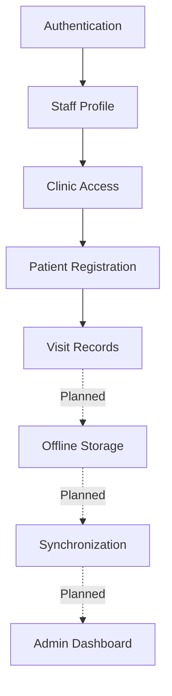
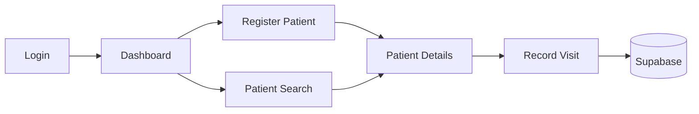

# HealthStats — Features

HealthStats is an offline-first healthcare record and disaster-response platform designed for rural clinics in Bangladesh.

---

## Feature Status Legend

| Status | Meaning |
|---|---|
| **Implemented** | Currently working in the application |
| **In Progress** | Partially implemented or UI built without backend wiring |
| **Planned** | Defined in the project plan but not implemented |
| **Optional** | Nice-to-have feature |
| **Not Started** | Identified but development has not begun |

---

## Feature Overview

| Feature | Category | Status | Priority |
|---|---|---|---|
| Authentication | Security | Implemented | Critical |
| Role-Based Access | Security | Implemented | Critical |
| Patient Registration | Patient Records | Implemented | Critical |
| Patient Search | Patient Records | Implemented | High |
| Visit Records & Forms | Patient Records | Implemented | High |
| Offline Storage | Offline-First | Implemented | Critical |
| Automatic Sync | Offline-First | Implemented | Critical |
| OCR | Intelligence | Implemented | Optional |
| AI-Assisted Triage | Intelligence | Deferred (Optional) | Optional |
| AI Assistant (Chatbot) | Intelligence | Implemented | Medium |
| Admin Dashboard | Administration | Implemented | Medium |
| Staff Management | Administration | Implemented | Medium |
| Emergency Mode | Disaster Response | Implemented | High |
| Outbreak Detection | Disaster Response | Implemented | Medium |
| Emergency Triage Queue | Disaster Response | Implemented | High |
| Clinic Coverage Map | Administration | Implemented | Medium |
| Bangla/English | Accessibility | Implemented (partial page coverage) | Critical |
| Dark Mode | UI/UX | Implemented | High |
| Motion & Animation | UI/UX | Implemented | Medium |
| Error/Empty/Loading States | UI/UX | Implemented | High |
| End-to-End Testing | Quality | Implemented (safe flows) | Medium |
| PWA | Platform | Not Started | High |

---

## 1. Product Vision

HealthStats is designed around:
1. **Offline-first healthcare records:** The app must never block the user waiting for a network request.
2. **Simple workflows for health workers:** Streamlined, large-tap-target interfaces.
3. **Secure role-based access:** Strict boundaries between clinics and administrative staff.
4. **Reliable synchronization:** Eventual consistency with a central database.
5. **Disaster-ready operations:** Specialized workflows for floods and cyclones.
6. **Bilingual accessibility:** Native Bangla support for rural contexts.
7. **Low-resource optimization:** Fast operation on older devices and low battery constraints (Dark mode).

---

## 2. Authentication & Access Control

### Login
- **Who can log in**: Pre-approved community health workers and clinic administrators.
- **Authentication Provider**: Supabase Auth (Email/Password).
- **Session Handling**: Managed globally via `AuthContext.tsx`. Unauthenticated users are redirected to `/login`.
- **Demo Mode**: For development and exhibition testing, entering `worker@clinic.org` with `password123` bypasses Supabase Auth and injects a mock session.

### Role-Based Access
- **Worker**: Authorized to log visits and register patients only for their assigned clinic.
- **Admin**: Authorized to view aggregated analytics across all clinics.

### Clinic-Level Access
Users are mapped to physical clinics via the `staff` table (`clinic_id`). The application strictly relies on this injected ID for mutations (like patient registration) rather than trusting user-provided inputs.

### Row Level Security (RLS)
The intended production security architecture uses Supabase RLS to protect all tables (`clinics`, `staff`, `patients`, `visits`, `sync_log`) and Security Definer functions to enforce that workers only interact with their own clinic's data. 
*(Note: In the current MVP development state, RLS is intentionally disabled in `initial_schema.sql` to facilitate rapid prototyping. Therefore, RLS does not currently protect the deployed MVP).*

---

## 3. Patient Record Management

### Patient Registration
- **Status**: Implemented
- **Workflow**: 
  - Validates inputs (Full Name, Age, Sex, Village, Emergency Contact).
  - Automatically injects the authenticated worker's `clinic_id`.
  - Submits directly to the Supabase `patients` table.
  - Success behavior: Displays a confirmation screen and routes the user to the newly created Patient Detail view.

### Patient List & Search
- **Status**: Implemented
- **Features**: Interface successfully lists patients mapped to the user's clinic and allows search by name/ID/village. Dynamic urgency and recency filtering is fully wired to Supabase.

### Patient Details & History
- **Status**: Implemented
- **Features**: `PatientDetailPage` loads the selected patient (name, age, sex, village, registration date, clinic) and all of their visits from Supabase. Tabs show Vitals History (per-visit readings from the `vitals` JSONB, with trend sparklines once 2+ readings exist), Visit History (clinician, symptom category, symptoms, diagnosis, urgency, sync status) and Diagnoses. Reachable from the Patients list (click a name), after registration, or after saving a visit. Fields with no schema backing (allergies, blood type, medications, emergency contact) are no longer shown.

---

## 4. Visit & Health Records

### Vitals & Clinical Forms
- **Status**: Implemented
- **Workflow** (`VitalsPage`, "Record Visit"):
  - Select a patient from the worker's clinic (searchable list), or arrive pre-selected via "New Visit" on a patient record.
  - Enter vitals (BP, temperature, pulse, weight, SpO₂, respiratory rate, MUAC) — only entered values are stored in the `vitals` JSONB.
  - Chief complaint (required, free text) and optional symptom chips → `symptoms`.
  - Symptom Category dropdown (`diarrhea/gastrointestinal`, `fever`, `respiratory`, `skin/rash`, `other`) → `symptom_category`, kept separate from the free-text symptoms for outbreak monitoring.
  - Diagnosis / assessment → `diagnosis`; Urgency Score 1–5 → `urgency_score` (the on-device AI Urgency Check pre-fills a suggestion; the worker can override).
  - Saves directly to `visits` with `patient_id`, `staff_id` (from the authenticated staff profile) and `synced_at`. Shows a success screen linking to the patient record.
- **Limitations**: Online only (no offline queue yet). English-only strings, consistent with the rest of the clinical forms. Visits cannot be edited after saving.

---

## 5. Offline-First Capability

*This is the core architectural pillar of HealthStats. Local queueing and background sync are **implemented** (Tasks 7–8); multi-device conflict resolution and a Service Worker for offline asset caching remain planned.*

### Online Mode
When internet is available, data mutations save directly to Supabase (visits set `synced_at` immediately).

### Offline Mode
When the network drops, patient registrations and visits are gracefully queued locally without blocking the user.

### Local Storage
Implemented using browser-based storage (IndexedDB via Dexie.js, `lib/offlineDb.ts`) to store pending records on the device.

### Sync Queue & Status
Records created offline sit in a local queue. `lib/syncService.ts` monitors `navigator.onLine` and pushes the queue on reconnect; the Sync Monitor page shows queued records and network state.

### Conflict Resolution
Conflict resolution logic (handling edits to the same record by two offline devices) is planned and is **not** currently implemented.

---

## 6. Data Synchronization

- **When it occurs**: Automatically when connectivity returns, managed by a Service Worker or background queue loop.
- **What gets synced**: Queued patient registrations and clinical visits.
- **Audit Logging**: Synchronizations will be securely logged in the `sync_log` table to monitor sync health and device IDs.

---

## 7. OCR / Paper Record Digitization

- **Status**: Implemented (Task 9A; `DigitizePage.tsx` using on-device Tesseract.js)
- **Purpose**: To quickly digitize legacy paper-based healthcare records using optical character recognition (OCR), easing the transition to the EHR system. Extracted fields are presented for worker review/edit before saving; OCR output is assistive and not guaranteed accurate.

---

## 8. AI-Assisted Triage
- **Purpose**: An algorithm (rule-based or lightweight ML) to automatically calculate an `urgency_score` based on entered vitals and symptoms, flagging patients who require immediate attention.
*(Note: This feature is currently deferred as an optional future enhancement. The project's primary intelligence path focuses on OCR digitization.)*

---

## 8.5 AI Assistant (Chatbot)

- **Status**: Implemented
- **Purpose**: A conversational assistant (`ChatWidget.tsx`) that helps authorized users retrieve real information from HealthStats and explains how the platform works.
- **Capabilities**: An intent engine (`chatbotService.ts`) maps free-text questions to **real Supabase queries** reused from `adminService` — total patients, records today, pending syncs, high-risk patients (count and named list), outbreak/cluster status, clinic activity, and patient look-up by name. Data-backed answers require an authenticated session and are scoped by the user's role/clinic (workers see only their clinic). On the public landing page the assistant answers only platform how-to questions (offline sync, OCR, triage, emergency mode, language, dark mode). Every figure comes from a live query; empty results, zero counts and database errors are reported honestly.
- **Grounding & limitations**: The assistant **never fabricates** patient, clinic, outbreak or medical data — it has no generative model and no external API; it only relays real query results or fixed platform facts. It is not a medical-advice tool (disclaimer shown). Because MVP RLS is disabled, data access is gated at the application layer via the auth context. Language is English-only.
- **Optional LLM mode (Groq)**: A secure Supabase Edge Function (`supabase/functions/groq-chat`) can power natural-language answers via Groq. The API key is stored **server-side** as a Supabase secret (never in the frontend bundle); the function fetches grounded, clinic-scoped Supabase context and instructs the model to answer only from it. If the function is not deployed or the device is offline, the assistant **falls back to the local grounded intent engine**, so behaviour never breaks. Enabling it sends clinic-scoped context to Groq (a third party) — a deployment/privacy choice for the operator.

---

## 9. Administration & Dashboard

### Admin Dashboard
- **Status**: Implemented
- **Capabilities**: Parallel Supabase queries for live metrics (Total Patients, Today's Records, Pending Syncs, High-Risk Flagged Patients), per-card loading skeletons and isolated error states, clinic analytics breakdowns, and high-risk patient review routing.

---

## 10. Staff Management

- **Status**: Implemented
- **Capabilities**: In-app UI for Admin staff management with real Supabase CRUD. Lists staff joined with clinics, provides Add Staff modal (with clinic assignment and clear notice on Supabase Auth account creation), Edit Staff modal (name, email, role, clinic), instant search, role/status/clinic filters, column sorting, pagination, and soft deactivation/reactivation toggle. Includes database migration `20260904000001_add_staff_is_active.sql`.

---

## 11. Emergency Mode

### Disaster Response Interface
- **Status**: Implemented
- **Purpose**: During floods or cyclones, health workers and emergency coordinators need rapid access to SOS protocols, active zone severity, deployed responders, and priority patient lists without navigating complex menus.
- **Capabilities**: Wired to live Supabase database (`clinics`, `visits` in past 48 hours, `patients`, and `staff`) via `adminService.fetchEmergencyMetrics()`. Features dynamic zone categorization by max urgency, live 1–5 triage priority queue with detail drill-down to `PatientDetailPage`, responder tracking per zone, interactive SOS incident broadcasting modal, and one-click situation report CSV export. External meteorological feeds remain planned.

---

## 12. Outbreak Detection

- **Status**: Implemented
- **Purpose**: A threshold-based symptom-cluster early warning surveillance system (`OutbreakDetectionPage.tsx`, `adminService.fetchOutbreakAnalysis()`).
- **Capabilities**: Analyzes recent clinical visits in Supabase by syndrome categories (Waterborne/Cholera, Febrile/Malaria, Acute Respiratory Infection, Cutaneous/Measles), groups cases by geographic zone & clinic, calculates cluster metrics and urgency scores, flags emerging outbreaks on the main admin overview banner, provides interactive WHO/field protocol checklists, enables linked patient drill-down into `PatientDetailPage`, and exports epidemiological CSV situation reports.

---

## 12.5 Clinic Operations Map

- **Status**: Implemented
- **Purpose**: A geographic overview of the clinic network so administrators can see where care is being delivered and which clinics have gone quiet.
- **Capabilities**: Wired to live Supabase data via `adminService.fetchClinicMapData()`. For every clinic it aggregates real patient counts, visit activity (last 24 hours / last 7 days), pending-sync backlog (`synced_at IS NULL`), recent high-risk cases (urgency ≥ 4) and the last visit time. Clinics are plotted on a hand-drawn Bangladesh SVG map by matching their `zone`/`name` against a district coordinate lookup (presentation-layer geocoding — the schema has **no** latitude/longitude and none was added). Each clinic is coloured by an honest activity status derived from visit recency: **Active** (visit in 24h), **Recent** (visit in 7d) or **Quiet** (no visits in 7d). Includes searchable/filterable sidebar, a quiet-clinic spotlight, hover tooltips, a per-clinic detail bar, loading/empty/error states and manual refresh.
- **Limitations**: No real per-clinic device/network status exists in the schema, so the map deliberately shows clinical *activity* rather than connectivity. Clinics whose `zone`/`name` does not match a known district are listed as "not on map" instead of being given a fabricated location. English-only, consistent with the other admin views.

---

## 13. Language Support

- **Status**: Implemented (infrastructure complete; UI coverage in progress)
- **Supported**: Bangla and English (English is the fallback)
- **Mechanism**: Application-wide internationalization built on `i18next` + `react-i18next` (Task 18). One centralized config (`src/i18n/index.ts`) with namespaced English/Bangla resources (`src/i18n/locales/en.ts`, `bn.ts`: `common`, `navigation`, `urgency`, `map`, `chatbot`, `errors`). i18next is the **single source of truth** for the active language; the existing `LanguageContext`/`useLang()` now delegates to it, so the language switcher, all `useTranslation()` components and all legacy inline-label components stay in sync. The selected language is persisted in `localStorage` (`hs-lang`) via the browser language detector and survives refresh and navigation.
- **Translated via keys (`t()`)**: the Ops Map (Task 16, `ClinicOpsPanel`) and the AI Assistant (Task 17, `ChatWidget` + `chatbotService`, including grounded replies), plus shared `common`/`urgency` labels. The landing page, navbar (switcher, links, CTAs) and dashboards remain localized through the shared language state.
- **Coverage / limitations**: Many deep worker/admin/clinical pages are **not yet translated** and still render English strings (e.g. `StaffPage`, `PatientRecordsPage`, `PatientDetailPage`, `VitalsPage`, `NewPatientPage`, `DigitizePage`, `SyncMonitorPage`, `FlaggedPatientsPage`, `EmergencyDashboard`, `EmergencyTriagePage`, `OutbreakDetectionPage`, `LoginPage`/`AdminLoginPage`, `SettingsPage`). The i18n architecture is in place for these to be migrated incrementally. Canonical database values (symptom categories, roles, urgency numbers) are **never** translated — only their display labels are.

---

## 14. UI / UX

- **Status**: Implemented
- **Features**: Desktop-first responsive layout, accessible typography, loading skeleton states, and explicit empty states.
- **Motion (Task 20)**: A small, consistent CSS motion language in `index.css` — entrance utilities (`animate-fade-in`, `animate-fade-up`, `animate-slide-up`, `animate-scale-in`) with `stagger-1…8` delay helpers, plus existing success/skeleton/sync animations. Timings are short (micro-interactions ~120–200ms, transitions ~150–300ms, entrances ~300–450ms) with ease-out curves. Applied tastefully: staggered landing-page hero reveal, calm dashboard card fade-in, and subtle chat message entrance; data-dense tables stay calm. A mandatory global `prefers-reduced-motion: reduce` guard near-instantly disables animations/transitions for users who request it. No marketing-style continuous/parallax motion; teal brand, urgency colors and Emergency Mode hierarchy are unchanged.
- **States (Task 21)**: Screens communicate loading, empty, error and recovery clearly. Content-heavy views use skeleton loaders; lists/tables have distinct "no data" vs "no results (clear filters)" empty states; failed loads show a plain-language message plus a Retry/Refresh action; Supabase calls fail gracefully (per-card `Promise.allSettled` on the admin dashboard) without exposing raw errors. Offline-first status is surfaced on the login, dashboard and sync screens ("saved locally, will sync when back online") rather than as a server error. The shared reusable state library (`EmptyStates.tsx`: `OfflineState`, `NoPatientsState`, `SyncFailedState`) is dark/light aware, accessible (`role="status"`/`"alert"`, `aria-live`, `aria-hidden` on decorative art) and takes real counts via props instead of placeholders. The chatbot message log and map states announce via ARIA live regions. Outbreak "no clusters detected" and triage "no patients requiring triage" use careful, non-diagnostic wording.
- **Dark Mode**: Fully integrated via `ThemeContext` for low-light environments and battery saving. Class-based (`.dark` on `<html>`), persisted in `localStorage` (`hs-theme`), with a flash-of-incorrect-theme guard applied in `index.html` before first paint (Task 19). A centralized Ashen Nebula token system (`--an-*` custom properties in `index.css`) plus consistent `dark:` utility variants now cover the full application — landing/auth, worker dashboard and clinical forms (patient registration, vitals, patient detail, OCR/digitize, sync), admin views (records, staff, flagged, analytics, settings, resources, alerts), map, emergency/triage, and the AI chatbot. Clinical urgency/status colors and Emergency Mode visual hierarchy are preserved with dark-tuned tints (no neon), and light mode is unchanged.
*(UI components strictly adhere to `docs/frontend-uiux.md`).*

---

## 15. Progressive Web App (PWA)

- **Status**: Planned
- **Capabilities**: Missing `manifest.json` and service worker caching required for true PWA installation and offline asset serving.

---

## 16. Security & Privacy

- **Supabase Authentication**: Protects all routes from unauthorized access.
- **Row Level Security**: Database-level enforcements to prevent cross-clinic data leakage.
- **Development Best Practices**: Developers are explicitly instructed to use fictional patient data only and to never commit `.env` secrets.

---

## 17. Feature Dependencies

---

## 18. Core User Flows

### Health Worker Flow

---

## 19. Development Roadmap

### Phase 0 — Foundation (Completed)
- React, Vite, Tailwind setup
- Supabase schema & authentication scaffolding

### Phase 1 — Patient & Visit Records (Completed)
- Patient registration
- Patient lists and retrieval, patient detail
- Visit / vitals forms

### Phase 2 — Offline Engine (Completed)
- IndexedDB storage integration (Dexie)
- Background sync queue (conflict resolution + Service Worker pending)

### Phase 3 — Intelligence (Completed / Partial)
- OCR for digitizing paper healthcare records (implemented, Tesseract.js)
- Grounded AI Assistant (implemented); AI-assisted triage scoring deferred

### Phase 4 — Emergency & Admin (Completed)
- Admin dashboards connected to live data
- Emergency Mode, Emergency Triage Queue, Clinic Operations Map
- Symptom clustering (Outbreak Detection); external weather/flood alert feeds pending

### Phase 5 — Testing & Demo (In Progress)
- End-to-end tests with Playwright (auth, landing desktop/mobile, i18n, dark mode, chatbot) — implemented (Task 22); run against a production preview server using the demo-login bypass (no real DB writes). DB-mutating flow coverage and unit tests pending an isolated test DB.
- PWA manifests (pending)
- Exhibition preparations (pending)

---

## 20. Current Implementation Status

| Area | Current Status | Notes |
|---|---|---|
| Database Schema | Implemented | `clinics`, `staff`, `patients`, `visits`, `sync_log` created |
| RLS | Planned / Production Required | RLS is the intended production security architecture but is disabled in the current MVP development schema |
| Authentication | Implemented | UI + Context + Demo Bypass + Admin role routing |
| Patient Registration | Implemented | Task 4 completed; successfully saves to Supabase |
| Patient Details/List | Implemented | Tasks 5/6; list and detail read from Supabase |
| Admin Patient Records | Implemented | Task 11; multi-clinic joins, name/ID/UUID search, 1–5 urgency filter, skeleton loader, dual empty states, CSV export, detail navigation |
| Vitals/Visits | Implemented | Task 6; `VitalsPage` inserts into `visits` |
| Admin Dashboard | Implemented | Task 10; live stat cards, weekly chart, clinics panel, staff CRUD, sync monitor wired to Supabase / Dexie |
| High-Risk Patients View | Implemented | Task 13; visits score >= 3, clinics join, real staff doctor assignment with persistence, search, urgency/clinic/assignment filters, detail navigation, CSV export |
| Emergency Mode | Implemented | Task 14; live database metrics (`clinics`, `visits` 48h, `patients`, `staff`), zone aggregation, 1–5 triage queue with detail drill-down, SOS broadcast modal, situation report CSV export |
| Outbreak Detection | Implemented | Task 14.5; threshold-based symptom cluster engine (`adminService.fetchOutbreakAnalysis()`), syndrome classification, early-warning banner, WHO checklist, patient drill-down, CSV export (`OutbreakDetectionPage.tsx`) |
| Emergency Triage Queue | Implemented | Task 15; authoritative 1–5 urgency scale, Red/Yellow/Green triage bands, interactive clinical status workflows (Start Care / In Treatment / Discharge / Revert), multi-attribute search, band filtering, CSV export, patient detail drill-down (`EmergencyTriagePage.tsx`) |
| Clinic Operations Map | Implemented | Task 16; live `clinics`/`patients`/`visits` aggregation via `fetchClinicMapData()`, district-name geocoding onto the Bangladesh SVG map, honest Active/Recent/Quiet activity status, patient/visit/pending-sync/high-risk metrics per clinic, quiet-clinic spotlight, filters, detail bar, loading/empty/error states (`ClinicOpsPanel.tsx`) |
| AI Assistant (Chatbot) | Implemented | Task 17; grounded intent engine (`chatbotService.ts`) reusing `adminService` queries for patient counts, records today, pending sync, high-risk list, outbreak status, clinic activity and patient look-up; auth/role scoped; platform how-to when signed out; never fabricates data (`ChatWidget.tsx`) |
| Offline Storage | Implemented | Task 7; Dexie.js offlineDb with pendingRecords queue |
| Background Sync | Implemented | Task 8; SyncService automatic sync on reconnection + SyncMonitorPage |
| PWA | Not Started | Manifest pending |
| OCR | Implemented | Task 9A; Tesseract.js client-side OCR on DigitizePage |

---

## 21. Exhibition Demo Priorities

For exhibition purposes, the core story is: **"Healthcare records remain useful even when the internet does not."**

Currently, the strongest demoable features are:
1. The **Patient Registration → Record Visit → Patient Record** flow (live database mutations and reads).
2. The **Admin Console & Operations** (live metrics, visits chart, clinics breakdown, staff management, and offline queue monitor).
3. The **Emergency Mode & Crisis Operations Center** (zone severity grouping, real 1–5 triage queue, doctor dispatch, SOS incident broadcast, and situation report export).
4. The **Outbreak Surveillance Radar & Early-Warning System** (syndrome-based clustering from clinical intake data, dashboard alerts, WHO action checklists, linked case tracing).
5. The **Offline Visit & Patient Queueing** (IndexedDB queueing via Dexie, automatic background sync upon reconnection).
6. The **Bilingual & Dark Mode UI** (accessibility).

---

## 22. Known Limitations

- **Emergency Mode:** External weather/flood sensor feeds remain planned (internal database metrics, zones, triage, and broadcast are fully implemented).
- **Worker Home Dashboard:** Quick stats (Patients Today, Total Patients, Pending Sync, High-Risk) and the recently-visited list are wired to live Supabase data (Task 24); the header "Worker ID" and "last synced" label remain display placeholders.
- **Translation:** Some deep UI elements lack complete Bangla translation strings.

---

## 23. Future Enhancements

- Robust sync conflict resolution.
- Native mobile app wrapping (Capacitor/React Native).
- Production-grade CI/CD and automated testing.
- SMS-based alerts for critical patients.
