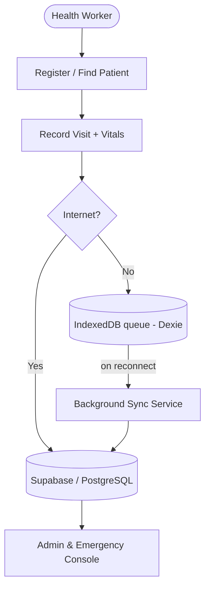
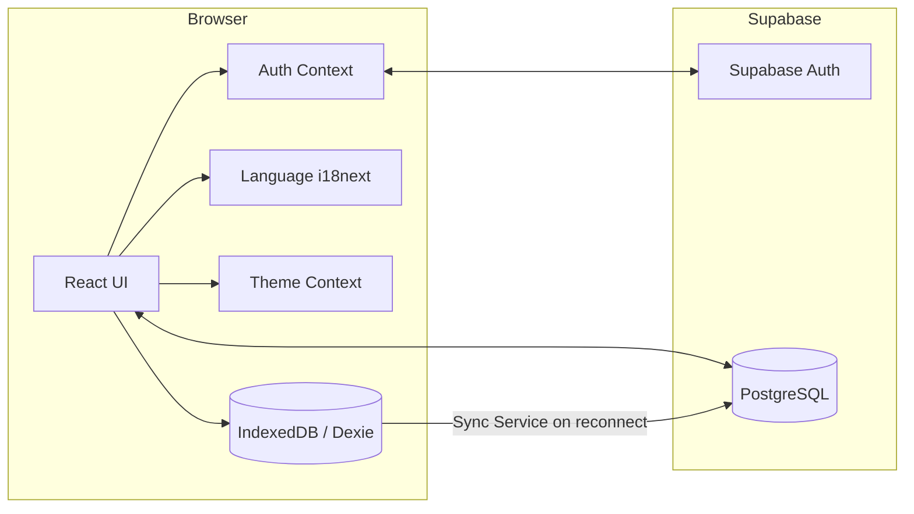
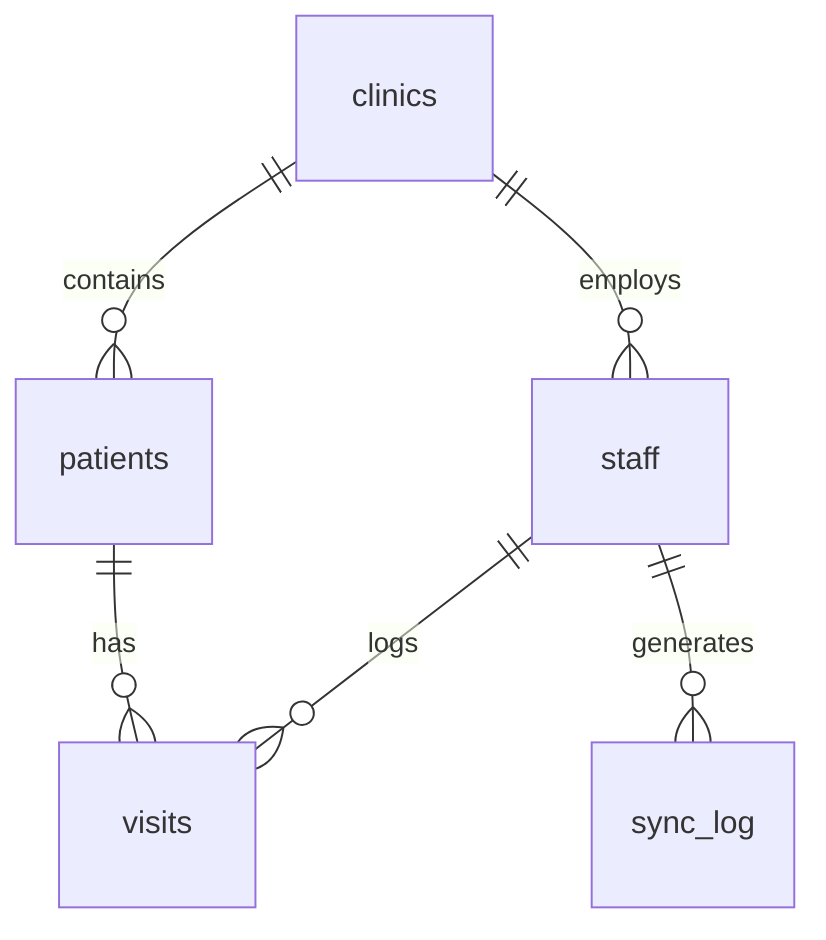

<div align="center">

# HealthStats

### Healthcare records that never stop working.

An **offline-first** electronic health record (EHR) and disaster-response platform for rural clinics in Bangladesh.

</div>

---

## Quick Summary

HealthStats is an EHR built for clinics that face **intermittent connectivity and frequent power outages**. Health workers register patients and record visits whether they are online or off — records are saved locally and **synchronized automatically when connectivity returns**. On top of the record system, HealthStats adds admin analytics, disaster/Emergency operations, a symptom-cluster early-warning surveillance view, a triage queue, a clinic operations map, and a data-grounded AI assistant. The interface is fully bilingual (English/Bangla) with light and dark themes.

> **Honesty note:** This is a hackathon/MVP build. It is functional end-to-end for the flows described below, but it is **not production-hardened** — most importantly, database Row Level Security is intentionally disabled in the MVP schema (see [Security](#security)). Known gaps are tracked openly in [LIMITATIONS.md](LIMITATIONS.md).

---

## Table of Contents
- [The Problem](#the-problem)
- [The Solution](#the-solution)
- [Key Features](#key-features)
- [Tech Stack](#tech-stack)
- [Architecture](#architecture)
- [Offline-First & Sync](#offline-first--sync)
- [OCR / Paper Digitization](#ocr--paper-digitization)
- [Emergency Intelligence](#emergency-intelligence)
- [AI Assistant](#ai-assistant)
- [Internationalization & Theme](#internationalization--theme)
- [Database](#database)
- [Security](#security)
- [Getting Started](#getting-started)
- [Demo Accounts](#demo-accounts)
- [Testing](#testing)
- [Project Structure](#project-structure)
- [Documentation](#documentation)
- [Roadmap & Status](#roadmap--status)
- [Team](#team)
- [License](#license)

---

## The Problem

Healthcare delivery in rural Bangladesh faces severe infrastructure challenges:

- **Paper-based records** are hard to query, easily damaged by floods, and slow to transfer.
- **Unreliable connectivity** makes standard cloud EHRs unusable for hours or days at a time.
- **Data fragmentation** means a patient's history rarely follows them when they migrate during a cyclone or flood.
- **Delayed coordination** — district coordinators lack real-time visibility into clinic load, high-risk patients, or emerging outbreaks during a crisis.

---

## The Solution

A resilient, offline-first workflow with a central coordination layer:



Records never block on the network: when offline, mutations are queued locally in IndexedDB and pushed to Supabase automatically once the device reconnects.

---

## Key Features

| Feature | Description | Status |
|---|---|---|
| **Authentication & RBAC** | Supabase Auth email/password; `worker` and `admin` roles with protected routes. | 🟢 Implemented |
| **Clinic scoping** | Mutations use the authenticated worker's `clinic_id` from context (app-layer). | 🟢 Implemented |
| **Patient registration** | Validated intake; auto-injects clinic; writes to Supabase. | 🟢 Implemented |
| **Patient records** | Server-side search, urgency filter, pagination, CSV export, detail view. | 🟢 Implemented |
| **Patient detail & history** | Demographics + visit/vitals history with trend sparklines. | 🟢 Implemented |
| **Visits / vitals** | Vitals JSONB, symptoms, symptom category, diagnosis, 1–5 urgency. | 🟢 Implemented |
| **Offline storage** | IndexedDB queue (Dexie) for patients & visits created offline. | 🟢 Implemented |
| **Background sync** | Auto-syncs the queue to Supabase on reconnect; sync monitor UI. | 🟢 Implemented |
| **OCR digitization** | On-device OCR (Tesseract.js) extracts fields from paper records for review. | 🟢 Implemented |
| **Admin dashboard** | Live stats, weekly visits chart, top-clinics panel. | 🟢 Implemented |
| **Staff management** | Supabase CRUD with clinic assignment, filters, soft deactivation. | 🟢 Implemented |
| **Flagged / high-risk** | Triage feed of urgent visits with doctor assignment + CSV export. | 🟢 Implemented |
| **Emergency Mode** | Crisis console: zones, triage queue, responders, SOS broadcast. | 🟢 Implemented |
| **Outbreak detection** | Threshold-based symptom-cluster early-warning surveillance. | 🟢 Implemented |
| **Emergency triage queue** | Red/Yellow/Green bands, clinical status workflow, drill-down. | 🟢 Implemented |
| **Clinic operations map** | Bangladesh map of clinics with live activity from real data. | 🟢 Implemented |
| **AI assistant** | Data-grounded chatbot (no fabrication); role/clinic scoped. | 🟢 Implemented |
| **Bilingual UI** | English/Bangla via i18next; persisted; core flows translated. | 🟢 Implemented (partial deep-page coverage) |
| **Dark mode** | App-wide light/dark theme with no-flash load. | 🟢 Implemented |
| **Motion & states** | Restrained motion system; loading/empty/error/recovery states. | 🟢 Implemented |
| **E2E tests** | Playwright suite for auth, landing, i18n, theme, chatbot. | 🟢 Implemented (safe flows) |
| **Conflict resolution / PWA** | Offline edit-conflict engine and installable PWA. | 🔵 Planned |

**Legend:** 🟢 Implemented · 🟡 In progress · 🔵 Planned. Full, itemized honesty in [LIMITATIONS.md](LIMITATIONS.md).

---

## Tech Stack

- **Frontend:** React 19, TypeScript 5.7, Vite 8
- **Styling:** Tailwind CSS 4 (Ashen Nebula design tokens; class-based dark mode)
- **Offline:** Dexie.js (IndexedDB) + a background sync service
- **OCR:** Tesseract.js (on-device)
- **i18n:** i18next + react-i18next + browser language detector
- **Backend / Data:** Supabase (PostgreSQL, Auth)
- **Testing:** Playwright (E2E)

---

## Architecture



- **Current:** Client ↔ Supabase Auth/DB directly; offline mutations queue in IndexedDB and sync on reconnect.
- **Routing:** state-based in `App.tsx`, gated by the authenticated `profile` (role/clinic).

---

## Offline-First & Sync

- **Local storage:** patient registrations and visits created without connectivity are stored in an IndexedDB queue (`lib/offlineDb.ts`, Dexie).
- **Pending state:** the UI marks records as saved-locally/pending; the Sync Monitor shows the queue and network status.
- **Synchronization:** `lib/syncService.ts` listens for reconnection (`navigator.onLine`) and pushes queued records to Supabase automatically; visits saved online set `synced_at` immediately.
- **Not yet built:** multi-device edit **conflict resolution** and a Service Worker for offline **asset** caching / installable PWA.

---

## OCR / Paper Digitization

The Digitize page runs **on-device OCR (Tesseract.js)** on a photo of a paper record and extracts fields (e.g. name, age, diagnosis). Nothing is auto-saved — the worker reviews and confirms every value before it is written. OCR output is assistive and **not guaranteed accurate**.

---

## Emergency Intelligence

- **Emergency Mode:** a crisis console driven by live data (`clinics`, recent `visits`, `patients`, `staff`) — active zones by severity, a 1–5 triage queue, deployed responders, an SOS broadcast modal, and situation-report CSV export.
- **Outbreak detection:** a **threshold-based symptom-cluster** engine that groups recent visits by syndrome and clinic zone and raises early-warning banners. It surfaces **potential outbreak clusters** for human review — it does **not** medically confirm outbreaks.
- **Triage queue:** authoritative 1–5 urgency scale with Red/Yellow/Green bands, interactive clinical status workflow, and patient drill-down; sorted by urgency then recency.

Urgency scale (unchanged everywhere): **5 Critical · 4 High · 3 Moderate · 2 Low · 1/null Stable.**

---

## AI Assistant

A **grounded intent engine** (`lib/chatbotService.ts`), not a generative model and not an external LLM. It answers a bounded set of questions from **real Supabase queries** (patient counts, records today, pending sync, high-risk list, outbreak status, clinic activity, patient look-up) or from fixed platform-fact strings (how offline sync/OCR/triage/emergency work).

- **It never fabricates** patient, clinic, outbreak, or medical data — empty/zero/error results are reported honestly.
- **Access is scoped:** data answers require an authenticated session and are scoped by role/clinic; the public landing page only answers "how it works" questions.
- **It does not perform clinical decision-making** and is not a substitute for medical advice.

---

## Internationalization & Theme

- **Languages:** English (fallback) and Bangla via i18next; the active language is persisted (`localStorage` `hs-lang`) and applies instantly across the app. The Ops Map, AI assistant, landing, navbar, dashboards and shared labels are localized; several deep admin/clinical pages still contain English strings pending migration (tracked in [LIMITATIONS.md](LIMITATIONS.md)).
- **Theme:** class-based light/dark mode (`ThemeContext`, persisted `hs-theme`) with a pre-paint guard against theme flash, covering the full product UI.

---

## Database

PostgreSQL on Supabase (`supabase/migrations/20260831000000_initial_schema.sql`).



- **`clinics`** — id, name, zone, address
- **`staff`** — id, name, role (`worker`/`admin`), clinic_id, auth_user_id, email, is_active
- **`patients`** — id, name, age, sex, village, clinic_id, created_at
- **`visits`** — id, patient_id, staff_id, vitals (JSONB), symptoms, symptom_category, diagnosis, urgency_score (1–5), created_at, synced_at
- **`sync_log`** — id, staff_id, device_id, status, timestamp

Additional migrations add `staff.is_active` and admin-auth setup.

---

## Security

- **Authentication:** all dashboard routes require a Supabase Auth session; unauthenticated users are redirected.
- **Role-based access:** distinct `worker` and `admin` routing; admin-only pages are gated by role.
- **Clinic scoping:** enforced at the **application layer** — mutations use the worker's `clinic_id` from the auth context rather than user input.
- **Row Level Security (RLS):** ⚠️ **RLS is intentionally DISABLED** in the MVP migration for rapid prototyping. This means clinic-level isolation is currently enforced only in the app, **not** by the database. Before any real deployment, RLS policies (with `SECURITY DEFINER` helpers) must be enabled. Do not treat this build as protecting real patient data.
- **Secrets:** only the Supabase **anon/publishable** key belongs in the frontend (`VITE_SUPABASE_ANON_KEY`). Never place a service/secret key in a `VITE_`-prefixed variable — Vite inlines it into the client bundle. Never commit `.env`. Use fictional patient data only.

---

## Getting Started

### Prerequisites
- Node.js (v22+ recommended)
- `npm` or `pnpm`
- A Supabase project

### 1. Clone & install
```bash
git clone https://github.com/sucksatcse/HealStats.git
cd HealStats/frontend
npm install     # or: pnpm install
```

### 2. Environment variables
Create `frontend/.env` (or project-root `.env`, per your setup) with **your** Supabase values — use placeholders here, never commit real keys:
```env
VITE_SUPABASE_URL="https://<your-project-ref>.supabase.co"
VITE_SUPABASE_ANON_KEY="<your-anon-or-publishable-key>"
```
Only the anon/publishable key belongs in the frontend.

### 3. Database
In the Supabase SQL Editor, run the migrations in `supabase/migrations/` (start with `20260831000000_initial_schema.sql`) and confirm the five tables exist. Note the RLS caveat in [Security](#security).

### 4. Run
```bash
npm run dev
```
The app starts at `http://localhost:8443/`.

---

## Demo Accounts

For UI review without provisioning real staff, the login screens accept demo bypass credentials that inject a mock session (no real credentials, no DB writes):

- **Worker:** `worker@clinic.org` / `password123`
- **Admin:** `admin@healstats.org` / `Admin@123456`

For real accounts, create a Supabase Auth user and a matching `staff` row (`auth_user_id`, `role`, `clinic_id`).

---

## Testing

```bash
cd frontend
npx tsc --noEmit     # type check
npm run build        # production build
npm run test:e2e     # Playwright E2E suite
```

- **E2E (Playwright):** covers authentication (sign-in/logout), the landing page (desktop + mobile), English↔Bangla switching with persistence, dark-mode persistence, and the AI chatbot. Tests run against a production `vite preview` server and use the demo-login bypass, so **no real database data is written** and no secrets are needed.
- **Not yet covered:** database-mutating journeys (registration, visits, offline sync, OCR save, admin CRUD) require an isolated test database; unit tests (Vitest) are pending. See [LIMITATIONS.md](LIMITATIONS.md).

---

## Project Structure

```text
HealthStats/
├── frontend/
│   ├── src/
│   │   ├── lib/                 # supabase client, adminService, chatbotService, offlineDb, syncService, ocrParser, types
│   │   ├── i18n/               # i18next config + en/bn locales
│   │   ├── App.tsx             # state-based router
│   │   ├── AuthContext.tsx / ThemeContext.tsx / LanguageContext.tsx
│   │   ├── *Page.tsx           # feature pages (dashboard, patients, vitals, map, emergency, …)
│   │   └── ChatWidget.tsx, ClinicOpsPanel.tsx, EmptyStates.tsx, …
│   ├── tests/e2e/             # Playwright specs
│   ├── playwright.config.ts
│   └── package.json
├── supabase/migrations/       # SQL schema & migrations
├── docs/frontend-uiux.md
├── FEATURES.md · PROGRESS.md · projectdetails.md · LIMITATIONS.md
└── README.md
```

---

## Documentation

- **[FEATURES.md](FEATURES.md)** — product feature specs and implementation status.
- **[PROGRESS.md](PROGRESS.md)** — task-by-task progress and notes.
- **[projectdetails.md](projectdetails.md)** — technical architecture and engineering rules.
- **[docs/frontend-uiux.md](docs/frontend-uiux.md)** — UI/UX, accessibility, and design conventions.
- **[LIMITATIONS.md](LIMITATIONS.md)** — honest list of known gaps and follow-ups.

---

## Roadmap & Status

- **Phase 0 — Foundation:** React/Vite/Tailwind, Supabase schema & auth. ✅
- **Phase 1 — Patient & Visit Records:** registration, records, detail, vitals. ✅
- **Phase 2 — Offline Engine:** Dexie storage + background sync. ✅
- **Phase 3 — Intelligence:** OCR digitization (implemented); AI-assisted triage scoring (deferred/optional).
- **Phase 4 — Admin & Emergency:** live admin console, Emergency Mode, outbreak detection, triage queue, map. ✅
- **Phase 5 — Product polish & QA:** i18n, dark mode, motion, states, E2E tests. ✅ (PWA + deployment pending)

---

## Team

- **Md. Tanjimul Islam** — Frontend + Backend
- **Enid Hasan** — Frontend
- **Tanjim Islam Turjo** — Frontend + Backend

---

## License

Intended license: **Mozilla Public License 2.0 (MPL-2.0)**, as stated in the app footer. A dedicated `LICENSE` file has not yet been added to the repository.
