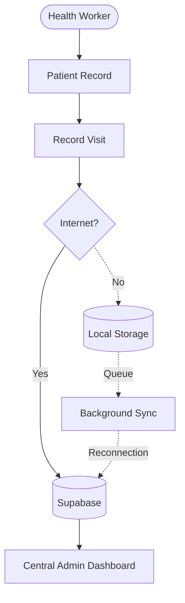
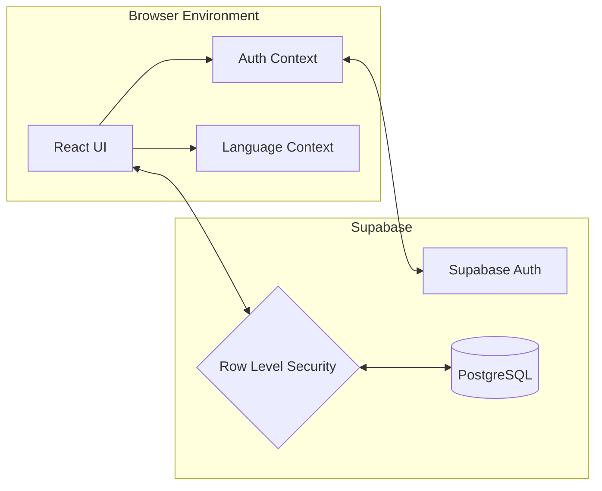
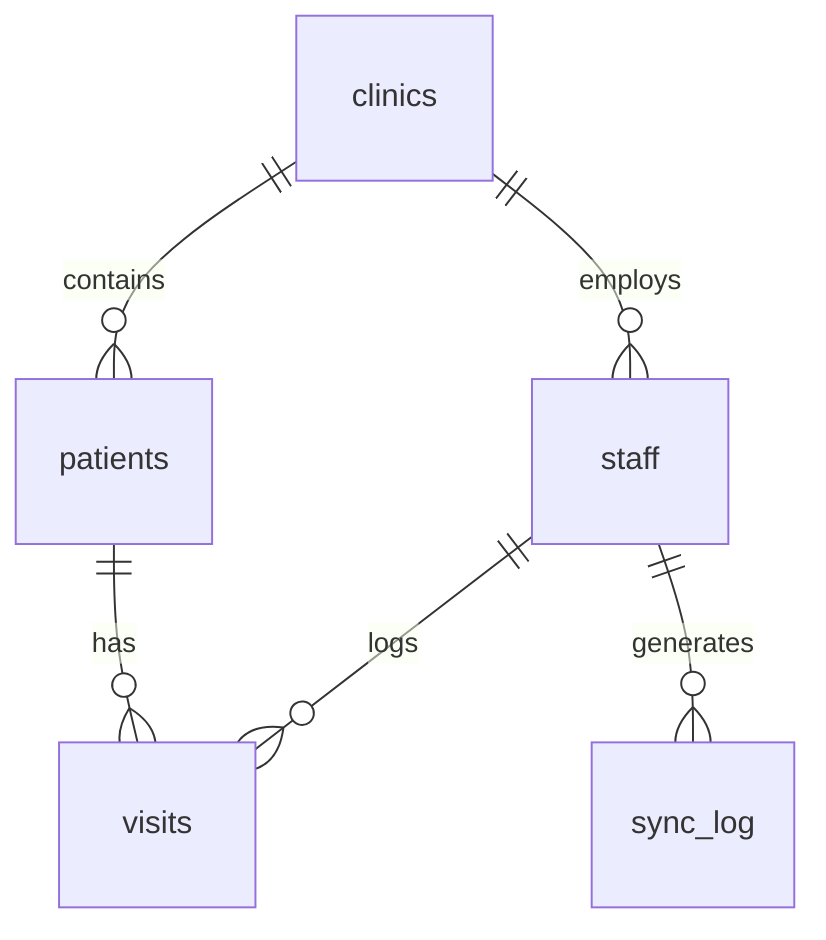

<div align="center">
  
# HealthStats

### Healthcare records that never stop working.

> An offline-first healthcare record system designed for clinics operating in low-connectivity environments.

</div>

---

## Quick Summary
HealthStats is an electronic health record (EHR) platform built specifically for rural clinics in Bangladesh. It is designed around an offline-first architectural goal. In environments where internet connectivity is intermittent and rolling power outages are frequent, the project aims to ensure community health workers can continue registering patients and logging visits regardless of network status. While the online patient registration flow is currently implemented, the core offline caching and automatic background synchronization systems are actively in development. 

## Table of Contents
- [The Problem](#the-problem)
- [The Solution](#the-solution)
- [Feature Highlights](#feature-highlights)
- [Tech Stack](#tech-stack)
- [Architecture](#architecture)
- [Database](#database)
- [Security](#security)
- [Project Structure](#project-structure)
- [Getting Started](#getting-started)
- [Authentication](#authentication)
- [Patient Registration](#patient-registration)
- [Development Workflow](#development-workflow)
- [Testing](#testing)
- [Troubleshooting](#troubleshooting)
- [Documentation](#documentation)
- [Current Status](#current-status)
- [Roadmap](#roadmap)
- [Exhibition Demo](#exhibition-demo)
- [Team](#team)

---

## The Problem
Healthcare delivery in rural Bangladesh is hindered by severe infrastructure challenges:
- **Paper-Based Limitations:** Physical records are difficult to query, easily damaged by floods, and slow to transfer.
- **Unreliable Connectivity:** Frequent internet drops render standard cloud-based EHR systems unusable for hours or days.
- **Data Fragmentation:** When patients migrate during a cyclone or flood, their medical history often does not follow them.
- **Delayed Responses:** Lack of centralized, real-time data makes it difficult for district coordinators to monitor clinic loads or allocate resources rapidly during an emergency.

---

## The Solution
HealthStats solves these problems through a resilient, offline-first workflow:


*(Note: The offline local storage and background sync are planned architectures, pending implementation).*

---

## Feature Highlights

| Feature | Description | Status |
|---|---|---|
| **Patient Records** | Search, register, and view demographic details. | 🟢 Implemented |
| **Authentication** | Secure login tied to specific clinic assignments. | 🟢 Implemented |
| **Bilingual UI** | Instantly toggle between English and Bangla. | 🟢 Implemented |
| **Dark Mode** | Low-light interface for battery saving and night shifts. | 🟢 Implemented |
| **Visit Forms** | Clinical intake forms for vitals and symptoms. | 🟡 In Progress |
| **Emergency Mode** | Disaster-response interfaces for floods/cyclones. | 🟡 In Progress |
| **Admin Dashboard** | High-level analytics across multiple clinics. | 🟡 In Progress |
| **Offline Storage** | IndexedDB caching for zero-connectivity operation. | 🔵 Planned |
| **Background Sync** | Automatic cloud reconciliation upon reconnection. | 🔵 Planned |
| **AI / OCR** | Assistive triage scoring or physical record scanning. | 🔵 Planned |

**Status Legend:**
- 🟢 **Implemented**: Currently working in the application.
- 🟡 **In Progress**: UI scaffolded, but pending database wiring or backend integration.
- 🔵 **Planned**: Defined in the project roadmap but not yet built.
- ⚪ **Optional**: Nice-to-have features under consideration.

---

## Tech Stack

### Frontend
- **React** 19.0.0
- **TypeScript** 5.7.0
- **Vite** 8.0.5

### Styling
- **Tailwind CSS** 4.0.0

### Backend / Data
- **Supabase** (BaaS)
- **PostgreSQL**

### Authentication
- **Supabase Auth** (Email/Password)

---

## Architecture


---

## Database

The relational schema is built on PostgreSQL and hosted on Supabase.



- **`clinics`**: Physical clinic locations (id, name, zone).
- **`staff`**: Application users mapped to Auth UIDs (role, clinic_id).
- **`patients`**: Beneficiaries registered at a clinic (name, age, sex).
- **`visits`**: Clinical encounters (vitals, symptoms, urgency_score).
- **`sync_log`**: Audit trail for offline sync events.

---

## Security

- **Authentication**: Users must log in via Supabase Auth to access any dashboard route. Unauthenticated users are redirected.
- **Role-Based Access**: The app supports distinct routing for `worker` and `admin` roles.
- **Row Level Security (RLS)**: The architectural goal is for PostgreSQL to enforce data boundaries using RLS (e.g., ensuring a worker in "Zone A" cannot query a patient in "Zone B"). **Important:** In the current repository state, the `initial_schema.sql` migration intentionally disables RLS to facilitate rapid prototyping and MVP testing. This development-only state differs significantly from the intended production architecture. Strict RLS policies must be applied before deploying with real data.

---

## Project Structure

```text
HealthStats/
├── frontend/
│   ├── src/
│   │   ├── lib/                  # Supabase client config
│   │   ├── App.tsx               # Main router
│   │   ├── AuthContext.tsx       # Session management
│   │   ├── NewPatientPage.tsx    # Registration workflow
│   │   └── ...                   # Additional components
│   ├── index.html
│   ├── package.json
│   └── vite.config.ts
├── supabase/
│   └── migrations/
│       └── 20260831000000_initial_schema.sql  # Database schema
├── docs/
│   └── frontend-uiux.md          # UI and accessibility rules
├── FEATURES.md                   # Detailed feature specifications
├── PROGRESS.md                   # Development progress tracker
├── .env.example                  # Environment variable template
└── README.md                     # Project documentation
```

---

## Getting Started

### Prerequisites
- Node.js (v22 recommended)
- `npm` or `pnpm`
- Git
- A Supabase account and project

### 1. Clone
```bash
git clone https://github.com/sucksatcse/HealStats.git
cd HealStats
```

### 2. Install
```bash
cd frontend
npm install
```

### 3. Environment Variables
1. Copy the example file at the root of the project: `cp .env.example .env`
2. Open `.env` and fill it with your exact credentials:
   ```env
      VITE_SUPABASE_URL="https://ckcovsgmiykenokkvxrk.supabase.co"
      VITE_SUPABASE_ANON_KEY="sb_publishable_GoqHBw-ekCFPlMHCkDKUdg_U2-IKgIh"
   ```

*Note: Never commit `.env` to version control. Never expose your Supabase `service_role` key.*

### 4. Supabase Setup
1. Open the [Supabase Dashboard](https://supabase.com/dashboard) and navigate to the **SQL Editor**.
2. Open `supabase/migrations/20260831000000_initial_schema.sql` from this repository.
3. Paste its contents into the SQL Editor and click **Run**.
4. Verify that the 5 tables (`clinics`, `staff`, `patients`, `visits`, `sync_log`) were created.
5. **Important Security Note:** The `initial_schema.sql` file currently contains commands that disable Row Level Security (RLS) for local development purposes. For any production deployment, you **must** remove the `DISABLE ROW LEVEL SECURITY` statements and implement strict RLS policies to protect patient data.

---

## Authentication

### How it Works
Upon login, `AuthContext.tsx` retrieves the Supabase `auth.uid()`, queries the `staff` table, and loads the user's `role` and `clinic_id` into global state. This state dictates which routes they can access and automatically injects their `clinic_id` into database mutations.

### Development / Test Account
Since an in-app Admin UI does not yet exist to create staff, you must create them manually for testing:
1. Create a user in Supabase **Authentication > Users** and copy their UID.
2. In the Supabase **SQL Editor**, run:
   ```sql
   INSERT INTO public.clinics (id, name, zone) VALUES ('11111111-1111-1111-1111-111111111111', 'Test Clinic', 'Zone A');
   INSERT INTO public.staff (name, role, clinic_id, auth_user_id, email) VALUES ('Test Worker', 'worker', '11111111-1111-1111-1111-111111111111', 'YOUR_COPIED_UID', 'worker@test.com');
   ```

*Demo Bypass:* For rapid UI development, entering `worker@clinic.org` / `password123` on the login screen intercepts the auth flow and injects a mock session.

---

## Running the Project

From the `frontend/` directory, start the Vite server:
```bash
npm run dev
```
The application will launch at `http://localhost:8443` (or the port specified in your terminal).

---

## Patient Registration

**Patient Registration (Task 4) is fully implemented.** 
- **Required Fields:** Full Name, Age, Sex, Village.
- **Validation:** Enforced prior to submission.
- **Clinic Assignment:** Automatically injects the worker's secure `clinic_id` from the Auth context. The user cannot manipulate this.
- **Behavior:** Upon clicking submit, a direct `INSERT` is made to the Supabase `patients` table. On success, the user is immediately routed to the new patient's detail view.

---

## Offline-First Workflow

### Currently Available
The UI is scaffolded with clear loading states and desktop/mobile responsiveness.

### In Development / Planned
The core offline mechanisms—intercepting network drops, storing data in IndexedDB/Dexie.js, queuing records, and running a background synchronization loop via a Service Worker—are actively pending development in Phase 2.

---

## Development Workflow

1. Ensure your local branch is up to date: `git pull origin main`
2. Create a feature branch: `git checkout -b feature/your-feature-name`
3. Run the development server: `npm run dev`
4. Make your changes in `frontend/src/`.
5. Test manually in the browser.
6. Commit using conventional commits.
7. Push your branch and open a Pull Request.

---

## Git Workflow

```bash
git checkout -b feature/patient-search
git add .
git commit -m "feat: add patient search functionality"
git push origin feature/patient-search
```

**Never commit:**
- `.env` files or hardcoded secrets.
- `node_modules`
- Build artifacts (`dist/`)

---

## Testing

Automated tests are not yet configured. Before submitting a PR, perform the following manual smoke-tests:

- [ ] Login completes successfully.
- [ ] Correct role-based dashboard loads.
- [ ] Patient registration inserts a new row into the Supabase database.
- [ ] Unauthorized administrative access is blocked.
- [ ] Logout correctly clears the session.
- [ ] Language and Dark Mode toggles operate cleanly.

---

## Troubleshooting

### Supabase connection fails
- Double-check that your `.env` file is in the root directory and contains the exact `VITE_SUPABASE_URL` and `VITE_SUPABASE_ANON_KEY`. Restart `npm run dev`.

### Login works but staff profile is missing
- Ensure that the `auth_user_id` in your PostgreSQL `staff` table exactly matches the UID of the user in Supabase Authentication. 

### RLS permission denied
- Verify that your user is assigned to a valid `clinic_id`.
- Ensure you aren't attempting to read records from a different clinic (unless you hold an `admin` role).

---

## Security Notes
- **Use Fictional Data:** Never use real patient names or medical information during development, testing, or exhibitions.
- **Service Roles:** Keep `.env` out of version control and never expose your Supabase `service_role` key to the frontend.
- **RLS:** Keep Row Level Security enabled in production to prevent data leakage.

---

## Documentation

- **[FEATURES.md](FEATURES.md)**: Detailed product specifications and exact implementation statuses.
- **[PROGRESS.md](PROGRESS.md)**: Development task tracking and phase completion.
- **[docs/frontend-uiux.md](docs/frontend-uiux.md)**: Frontend design, UX, accessibility, and implementation guidelines.

---

## Current Status

### Implemented
- Database Schema (`clinics`, `staff`, `patients`, `visits`, `sync_log`)
- Authentication & Protected Routes
- Language Context (Bangla/English) & Theme Context (Dark Mode)
- Patient Registration (Live Supabase Mutation)

### In Progress
- Patient Details / Patient Lists
- Clinical Visit Forms
- Admin & Emergency UI Shells

### Planned
- IndexedDB Offline Storage
- Background Synchronization
- Outbreak Detection
- PWA Configuration

---

## Roadmap

- **Phase 0 — Foundation:** React, Vite, Tailwind setup; Supabase Auth & Schema. *(Completed)*
- **Phase 1 — Patient & Visit Records:** Registration, records, vitals forms. *(In Progress)*
- **Phase 2 — Intelligence:** Proof-of-concept OCR or AI-Assisted Triage. *(Pending)*
- **Phase 3 — Administration:** Live admin dashboards and staff management. *(Pending)*
- **Phase 4 — Emergency Mode:** Disaster alerts and outbreak detection. *(Pending)*
- **Phase 5 — Testing & Exhibition:** PWA wrapping and demo preparation. *(Pending)*

---

## Exhibition Demo

To demonstrate the core value of HealthStats:

1. **Worker Login:** Enter `worker@clinic.org` / `password123` to bypass authentication and inject a test session.
2. **Accessibility:** Highlight the instant English-to-Bangla translation and Dark Mode toggle.
3. **Register Patient:** Navigate to "New Patient" and complete the form.
4. **Verification:** Submit the form and open the live Supabase Table Editor to prove the data transmitted securely to the cloud.
5. **Emergency Mode:** Open the Emergency Dashboard to showcase the conceptual disaster-response workflow.

*(Note: True offline capability is currently in development. Do not fake offline functionality for the demo.)*

---

## Team

- **Md. Tanjimul Islam** — Frontend + Backend
- **Enid Hasan** — Frontend
- **Tanjim Islam Turjo** — Frontend + Backend

---

License: Not yet specified.
