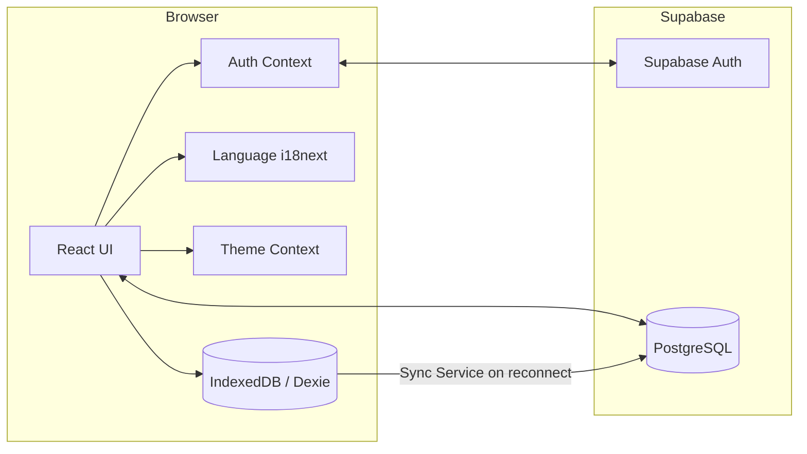
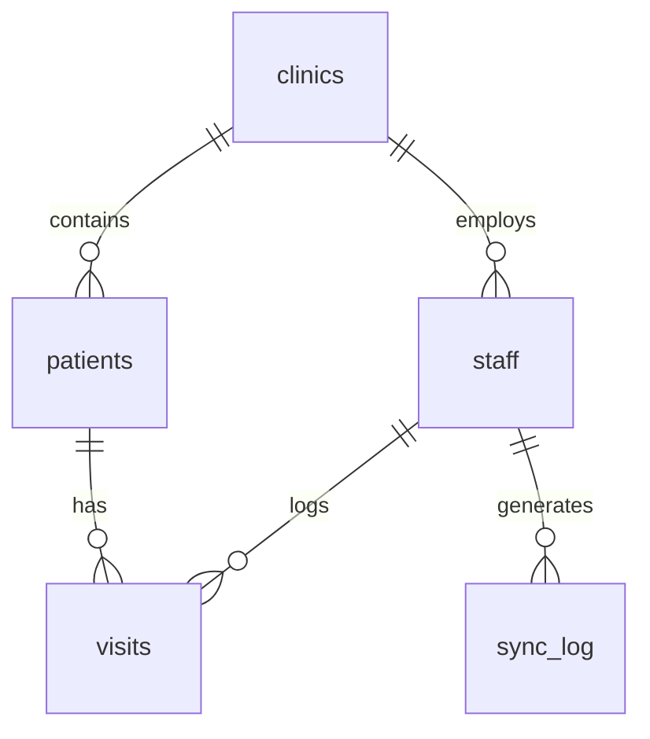

<div align="center">
  
# HealStates

### Healthcare records that never stop working.

An **offline-first** electronic health record (EHR) and disaster-response platform for rural clinics in Bangladesh.

</div>

---

## Quick Summary
HealStates is an electronic health record (EHR) platform built specifically for rural clinics in Bangladesh. It is designed around an offline-first architectural goal. In environments where internet connectivity is intermittent and rolling power outages are frequent, the project aims to ensure community health workers can continue registering patients and logging visits regardless of network status. While the online patient registration flow is currently implemented, the core offline caching and automatic background synchronization systems are actively in development. 

## Table of Contents
- [The Problem](#the-problem)
- [The Solution](#the-solution)
- [Key Features](#key-features)
- [Tech Stack](#tech-stack)
- [Architecture](#architecture)
- [Offline-First & Sync](#offline-first--sync)
- [OCR / Paper Digitization](#ocr--paper-digitization)
- [Emergency Intelligence](#emergency-intelligence)
- [AI Assistant](#ai-assistant)
- [Internationalization & Theme](#internationalization--theme)
- [Database](#database)
- [Security](#security)
- [Getting Started](#getting-started)
- [Demo Accounts](#demo-accounts)
- [Testing](#testing)
- [Project Structure](#project-structure)
- [Documentation](#documentation)
- [Roadmap & Status](#roadmap--status)
- [Team](#team)
- [License](#license)

---

## The Problem

Healthcare delivery in rural Bangladesh faces severe infrastructure challenges:

- **Paper-based records** are hard to query, easily damaged by floods, and slow to transfer.
- **Unreliable connectivity** makes standard cloud EHRs unusable for hours or days at a time.
- **Data fragmentation** means a patient's history rarely follows them when they migrate during a cyclone or flood.
- **Delayed coordination** — district coordinators lack real-time visibility into clinic load, high-risk patients, or emerging outbreaks during a crisis.

---

## The Solution
HealStates solves these problems through a resilient, offline-first workflow:


Records never block on the network: when offline, mutations are queued locally in IndexedDB and pushed to Supabase automatically once the device reconnects.

---

## Key Features

| Feature | Description | Status |
|---|---|---|
| **Authentication & RBAC** | Supabase Auth email/password; `worker` and `admin` roles with protected routes. | 🟢 Implemented |
| **Clinic scoping** | Mutations use the authenticated worker's `clinic_id` from context (app-layer). | 🟢 Implemented |
| **Patient registration** | Validated intake; auto-injects clinic; writes to Supabase. | 🟢 Implemented |
| **Patient records** | Server-side search, urgency filter, pagination, CSV export, detail view. | 🟢 Implemented |
| **Patient detail & history** | Demographics + visit/vitals history with trend sparklines. | 🟢 Implemented |
| **Visits / vitals** | Vitals JSONB, symptoms, symptom category, diagnosis, 1–5 urgency. | 🟢 Implemented |
| **Offline storage** | IndexedDB queue (Dexie) for patients & visits created offline. | 🟢 Implemented |
| **Background sync** | Auto-syncs the queue to Supabase on reconnect; sync monitor UI. | 🟢 Implemented |
| **OCR digitization** | On-device OCR (Tesseract.js) extracts fields from paper records for review. | 🟢 Implemented |
| **Admin dashboard** | Live stats, weekly visits chart, top-clinics panel. | 🟢 Implemented |
| **Staff management** | Supabase CRUD with clinic assignment, filters, soft deactivation. | 🟢 Implemented |
| **Flagged / high-risk** | Triage feed of urgent visits with doctor assignment + CSV export. | 🟢 Implemented |
| **Emergency Mode** | Crisis console: zones, triage queue, responders, SOS broadcast. | 🟢 Implemented |
| **Outbreak detection** | Threshold-based symptom-cluster early-warning surveillance. | 🟢 Implemented |
| **Emergency triage queue** | Red/Yellow/Green bands, clinical status workflow, drill-down. | 🟢 Implemented |
| **Clinic operations map** | Leaflet zoom/pan, real coordinates, clinic/place search, activity filters and admin location editor. | 🟡 Tested with mocks; coordinate migration/backfill and production proxy pending |
| **AI assistant** | Data-grounded chatbot (no fabrication); role/clinic scoped. | 🟢 Implemented |
| **Bilingual UI** | English/Bangla via i18next; persisted; core flows translated. | 🟢 Implemented (partial deep-page coverage) |
| **Dark mode** | App-wide light/dark theme with no-flash load. | 🟢 Implemented |
| **Motion & states** | Restrained motion system; loading/empty/error/recovery states. | 🟢 Implemented |
| **E2E tests** | Playwright suite for auth, landing, i18n, theme, chatbot. | 🟢 Implemented (safe flows) |
| **Conflict resolution / PWA** | Offline edit-conflict engine and installable PWA. | 🔵 Planned |

**Legend:** 🟢 Implemented · 🟡 In progress · 🔵 Planned. Full, itemized honesty in [LIMITATIONS.md](LIMITATIONS.md).

---

## Tech Stack

- **Frontend:** React 19, TypeScript 5.7, Vite 8
- **Styling:** Tailwind CSS 4 (Ashen Nebula design tokens; class-based dark mode)
- **Offline:** Dexie.js (IndexedDB) + a background sync service
- **OCR:** Tesseract.js (on-device)
- **i18n:** i18next + react-i18next + browser language detector
- **Backend / Data:** Supabase (PostgreSQL, Auth)
- **Testing:** Playwright (E2E)

---

## Architecture



- **Current:** Client ↔ Supabase Auth/DB directly; offline mutations queue in IndexedDB and sync on reconnect.
- **Routing:** state-based in `App.tsx`, gated by the authenticated `profile` (role/clinic).

---

## Offline-First & Sync

- **Local storage:** patient registrations and visits created without connectivity are stored in an IndexedDB queue (`lib/offlineDb.ts`, Dexie).
- **Pending state:** the UI marks records as saved-locally/pending; the Sync Monitor shows the queue and network status.
- **Synchronization:** `lib/syncService.ts` listens for reconnection (`navigator.onLine`) and pushes queued records to Supabase automatically; visits saved online set `synced_at` immediately.
- **Not yet built:** multi-device edit **conflict resolution** and a Service Worker for offline **asset** caching / installable PWA.

---

## OCR / Paper Digitization

The Digitize page runs **on-device OCR (Tesseract.js)** on a photo of a paper record and extracts fields (e.g. name, age, diagnosis). Nothing is auto-saved — the worker reviews and confirms every value before it is written. OCR output is assistive and **not guaranteed accurate**.

---

## Emergency Intelligence

```text
HealStates/
├── frontend/
│   ├── src/
│   │   ├── lib/                  # Supabase client config
│   │   ├── App.tsx               # Main router
│   │   ├── AuthContext.tsx       # Session management
│   │   ├── NewPatientPage.tsx    # Registration workflow
│   │   └── ...                   # Additional components
│   ├── index.html
│   ├── package.json
│   └── vite.config.ts
├── supabase/
│   └── migrations/
│       └── 20260831000000_initial_schema.sql  # Database schema
├── docs/
│   └── frontend-uiux.md          # UI and accessibility rules
├── FEATURES.md                   # Detailed feature specifications
├── PROGRESS.md                   # Development progress tracker
├── .env.example                  # Environment variable template
└── README.md                     # Project documentation
```

---

## AI Assistant

A **grounded intent engine** (`lib/chatbotService.ts`), not a generative model and not an external LLM. It answers a bounded set of questions from **real Supabase queries** (patient counts, records today, pending sync, high-risk list, outbreak status, clinic activity, patient look-up) or from fixed platform-fact strings (how offline sync/OCR/triage/emergency work).

- **It never fabricates** patient, clinic, outbreak, or medical data — empty/zero/error results are reported honestly.
- **Access is scoped:** data answers require an authenticated session and are scoped by role/clinic; the public landing page only answers "how it works" questions.
- **It does not perform clinical decision-making** and is not a substitute for medical advice.

**Optional LLM mode (Groq):** a secure Supabase Edge Function (`supabase/functions/groq-chat`) can answer in natural language via Groq. The API key is stored **server-side** as a Supabase secret — never in the frontend bundle — and the function grounds the model on clinic-scoped Supabase data. If it is not deployed (or the device is offline) the assistant automatically falls back to the built-in grounded engine. To enable:
```bash
supabase functions deploy groq-chat
supabase secrets set GROQ_API_KEY=<your-rotated-groq-key>   # never commit this
```

---

## Internationalization & Theme

- **Languages:** English (fallback) and Bangla via i18next; the active language is persisted (`localStorage` `hs-lang`) and applies instantly across the app. The Ops Map, AI assistant, landing, navbar, dashboards and shared labels are localized; several deep admin/clinical pages still contain English strings pending migration (tracked in [LIMITATIONS.md](LIMITATIONS.md)).
- **Theme:** class-based light/dark mode (`ThemeContext`, persisted `hs-theme`) with a pre-paint guard against theme flash, covering the full product UI.

---

## Database

PostgreSQL on Supabase (`supabase/migrations/20260831000000_initial_schema.sql`).



- **`clinics`** — id, name, zone, address
- **`staff`** — id, name, role (`worker`/`admin`), clinic_id, auth_user_id, email, is_active
- **`patients`** — id, name, age, sex, village, clinic_id, created_at
- **`visits`** — id, patient_id, staff_id, vitals (JSONB), symptoms, symptom_category, diagnosis, urgency_score (1–5), created_at, synced_at
- **`sync_log`** — id, staff_id, device_id, status, timestamp

Additional migrations add `staff.is_active` and admin-auth setup.

---

## Security

- **Authentication:** all dashboard routes require a Supabase Auth session; unauthenticated users are redirected.
- **Role-based access:** distinct `worker` and `admin` routing; admin-only pages are gated by role.
- **Clinic scoping:** enforced at the **application layer** — mutations use the worker's `clinic_id` from the auth context rather than user input.
- **Row Level Security (RLS):** ⚠️ **RLS is intentionally DISABLED** in the MVP migration for rapid prototyping. This means clinic-level isolation is currently enforced only in the app, **not** by the database. Before any real deployment, RLS policies (with `SECURITY DEFINER` helpers) must be enabled. Do not treat this build as protecting real patient data.
- **Secrets:** only the Supabase **anon/publishable** key belongs in the frontend (`VITE_SUPABASE_ANON_KEY`). Never place a service/secret key in a `VITE_`-prefixed variable — Vite inlines it into the client bundle. Never commit `.env`. Use fictional patient data only.

---

## Getting Started

### Prerequisites
- Node.js (v22+ recommended)
- `npm` or `pnpm`
- A Supabase project

### 1. Clone & install
```bash
git clone https://github.com/sucksatcse/HealStats.git
cd HealStats/frontend
npm install     # or: pnpm install
```

 ### 2. Environment variables
Create `frontend/.env` (or project-root `.env`, per your setup) with **your** Supabase values — use placeholders here, never commit real keys:
```env
VITE_SUPABASE_URL=SUPABASE_URL
VITE_SUPABASE_ANON_KEY=SUPABASE_ANON_KEY
```
Only the anon/publishable key belongs in the frontend.

### 3. Database
In the Supabase SQL Editor, run the migrations in `supabase/migrations/` (start with `20260831000000_initial_schema.sql`) and confirm the five tables exist. Note the RLS caveat in [Security](#security).

### 4. Run
```bash
npm run dev
```
The app starts at `http://localhost:8443/`.

### Admin map setup — prepared, not deployed

The admin Ops Map uses Leaflet/react-leaflet with OpenStreetMap standard tiles and CARTO dark tiles, without paid keys. The public coverage map remains intentionally static. **No database migration or backfill was applied during implementation.**

1. **Database prerequisite:** an authorized operator must review and apply only [the coordinate migration](supabase/migrations/20260908000000_add_clinic_coordinates.sql) to the intended environment. Do not run all historical migrations blindly. Existing clinic coordinates start null; the map never substitutes district centroids. Before this migration, clinic listings still load but location editing is disabled.
2. **Clinic locations:** administrators can create/edit clinics inside Ops Map using coordinate inputs, map placement, or explicit address search. Verify the actual clinic location before saving any geocoded candidate. Saving is online-only and checks the authenticated staff role. Database-level authorization/RLS must be separately verified; the MVP's disabled-RLS state is not made secure by UI checks.
3. **Geocoding development:** Vite dev exposes `/api/geocode` through the shared Node middleware, using the existing root environment configuration. Search requires an active administrator. There is no external request while typing and no background geocoding on map load.
4. **Geocoding production:** deploy [the standalone server](frontend/server/geocoding.mjs) using the `geocoding:serve` package script, with Node 22+. Reverse-proxy `/api/geocode` on the app origin to this server (default bind `127.0.0.1:4600`). `vite preview` and static hosting alone do **not** provide it. Backend-only configuration: `SUPABASE_URL`, `SUPABASE_ANON_KEY`; optional `HOST`, `PORT`, `NOMINATIM_URL`, `NOMINATIM_USER_AGENT` (set identifying operator contact), and `NOMINATIM_CACHE_PATH` (private persistent disk). Never put service-role keys in `VITE_` variables.
5. **Rate limit and cache:** run **one proxy process for the entire application**, not replicas with separate caches. It serializes uncached requests ≥1100ms apart and persists successful and empty results. Provider 429/503 responses cause cooldown without automatic retries. Keep the cache private and stable across deployments. The exclusive lifetime disk lock also prevents a backfill from running alongside the proxy; after a crash, verify the owner process has stopped before manually removing its lock directory.
6. **One-time backfill (operator action only):** [the backfill tool](frontend/scripts/backfill-clinic-coordinates.mjs) prints instructions without accessing anything when called with no arguments or `--help`. Separate `--lookup --allow-clinic-address-sharing` reads missing-coordinate clinics and shares only zone/address with Nominatim, checkpointing results without DB writes. Every candidate requires human review, even a single match. Set `reviewed`, `selectedId`, `clinicLocationConfirmed`, `reviewedBy`, and `reviewedAt` in the private checkpoint after independently verifying the actual clinic. A separate `--apply` conditionally writes reviewed coordinates only while both stored coordinates remain null and address/zone are unchanged. No automatic retries of ambiguous writes. Stop the proxy before either stage; use the same persistent cache path. Operator credentials are read from backend environment variables, never CLI arguments. See the tool's `--help` for the admin-session or service-role operator options. Lookup stops at 1000 new queries or 23 hours; do not schedule it as recurring work.

**Provider policy:** Follow [Nominatim's usage policy](https://operations.osmfoundation.org/policies/nominatim/) (one request/sec across the app, explicit user searches, caching, no autocomplete, small one-time bulk use only) and [OSM's tile policy](https://operations.osmfoundation.org/policies/tiles/) (visible attribution, browser caching, no offline/bulk tile downloads). Do not submit patient/private information. For larger or recurring geocoding workloads, use a suitable self-hosted provider rather than the public Nominatim instance. The free services are best-effort online dependencies; errors are shown without fabricating locations.

**Map semantics:** Active = visit in 24h; Recent = visit in 7d but not 24h; Quiet = no seven-day visits. High-risk counts visits, not unique patients. Pending sync covers server rows only, not remote device queues. Last-visit display is limited to the seven-day query window. Data refresh is manual, not a live subscription. The latitude/longitude bounds are a rectangular validation envelope, not exact national borders.

**Validation:** `test:unit` includes 96 Vitest and 28 Node proxy/backfill tests; 53 Playwright tests pass with map APIs, database writes, and tiles intercepted locally. This validates implementation behavior, not live deployment or RLS enforcement. No real tile/geocoding requests or DB writes are needed for automated tests.

---

## Demo Accounts

For UI review without provisioning real staff, the login screens accept demo bypass credentials that inject a mock session (no real credentials, no DB writes):

- **Worker:** `worker@clinic.org` / `password123`
- **Admin:** `admin@healstats.org` / `Admin@123456`

For real accounts, create a Supabase Auth user and a matching `staff` row (`auth_user_id`, `role`, `clinic_id`).

---

## Testing

```bash
cd frontend
npx tsc --noEmit     # type check
npm run build        # production build
npm run test:e2e     # Playwright E2E suite
```

- **E2E (Playwright):** covers authentication (sign-in/logout), the landing page (desktop + mobile), English↔Bangla switching with persistence, dark-mode persistence, and the AI chatbot. Tests run against a production `vite preview` server and use the demo-login bypass, so **no real database data is written** and no secrets are needed.
- **Not yet covered:** database-mutating journeys (registration, visits, offline sync, OCR save, admin CRUD) require an isolated test database; unit tests (Vitest) are pending. See [LIMITATIONS.md](LIMITATIONS.md).

---

## Project Structure

```text
HealStats/
├── frontend/
│   ├── src/
│   │   ├── lib/                 # supabase client, adminService, chatbotService, offlineDb, syncService, ocrParser, types
│   │   ├── i18n/               # i18next config + en/bn locales
│   │   ├── App.tsx             # state-based router
│   │   ├── AuthContext.tsx / ThemeContext.tsx / LanguageContext.tsx
│   │   ├── *Page.tsx           # feature pages (dashboard, patients, vitals, map, emergency, …)
│   │   └── ChatWidget.tsx, ClinicOpsPanel.tsx, EmptyStates.tsx, …
│   ├── tests/e2e/             # Playwright specs
│   ├── playwright.config.ts
│   └── package.json
├── supabase/migrations/       # SQL schema & migrations
├── docs/frontend-uiux.md
├── FEATURES.md · PROGRESS.md · projectdetails.md · LIMITATIONS.md
└── README.md
```

---

## Documentation

- **[FEATURES.md](FEATURES.md)** — product feature specs and implementation status.
- **[PROGRESS.md](PROGRESS.md)** — task-by-task progress and notes.
- **[projectdetails.md](projectdetails.md)** — technical architecture and engineering rules.
- **[docs/frontend-uiux.md](docs/frontend-uiux.md)** — UI/UX, accessibility, and design conventions.
- **[LIMITATIONS.md](LIMITATIONS.md)** — honest list of known gaps and follow-ups.

---

## Exhibition Demo

To demonstrate the core value of HealStates:

- **Phase 0 — Foundation:** React/Vite/Tailwind, Supabase schema & auth. ✅
- **Phase 1 — Patient & Visit Records:** registration, records, detail, vitals. ✅
- **Phase 2 — Offline Engine:** Dexie storage + background sync. ✅
- **Phase 3 — Intelligence:** OCR digitization (implemented); AI-assisted triage scoring (deferred/optional).
- **Phase 4 — Admin & Emergency:** live admin console, Emergency Mode, outbreak detection, triage queue, map. ✅
- **Phase 5 — Product polish & QA:** i18n, dark mode, motion, states, E2E tests. ✅ (PWA + deployment pending)

---

## Team

- **Md. Tanjimul Islam** — Frontend + Backend
- **Enid Hasan** — Frontend
- **Tanjim Islam Turja** — Frontend + Backend

---

## License

Intended license: **Mozilla Public License 2.0 (MPL-2.0)**, as stated in the app footer. A dedicated `LICENSE` file has not yet been added to the repository.
